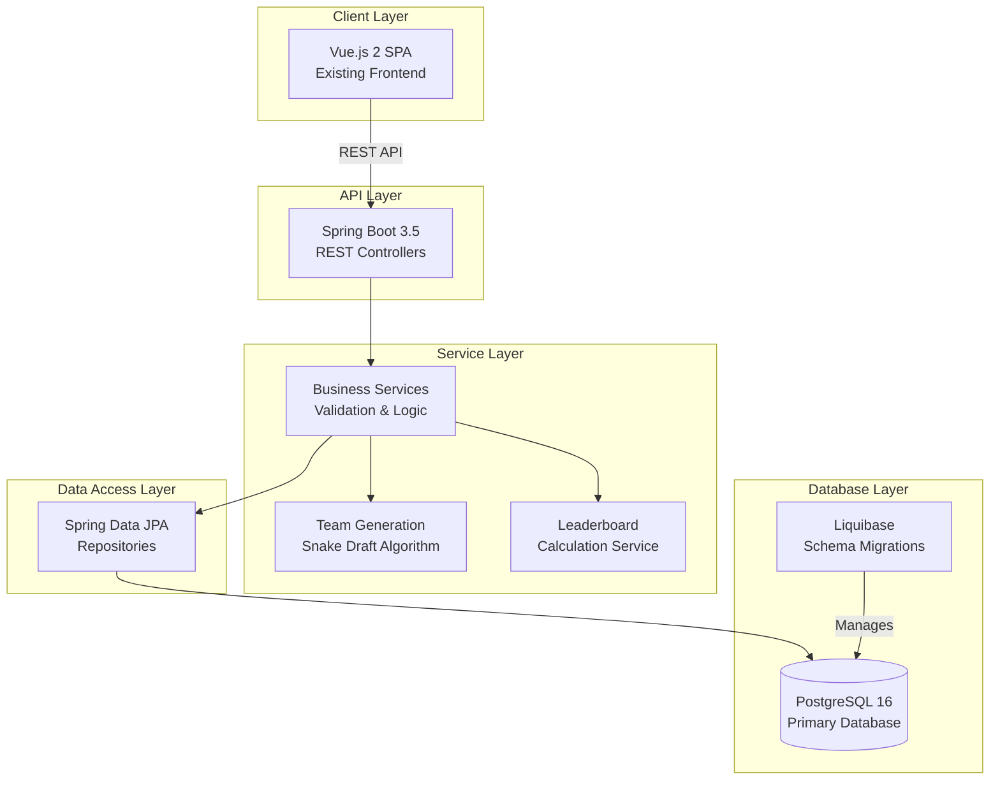
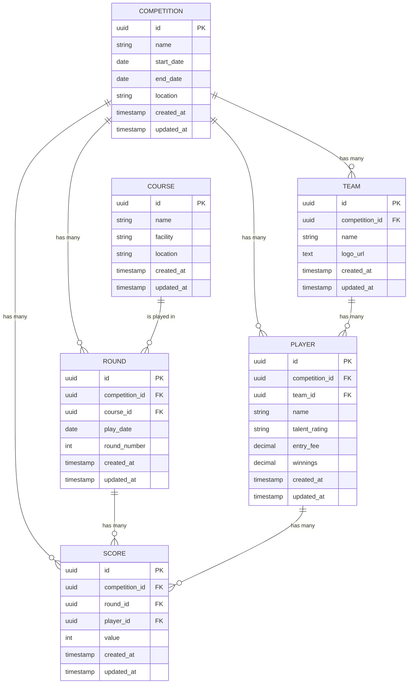
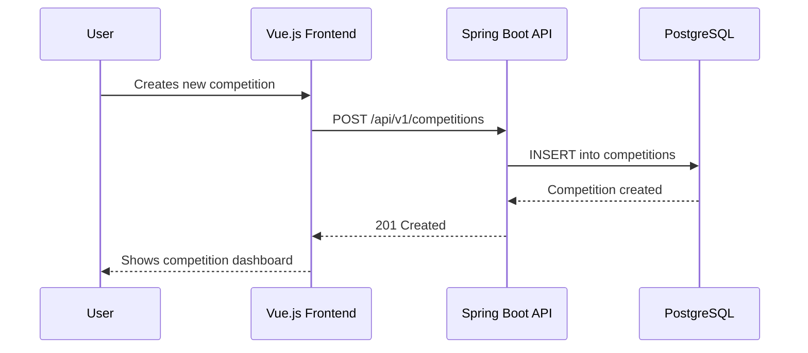
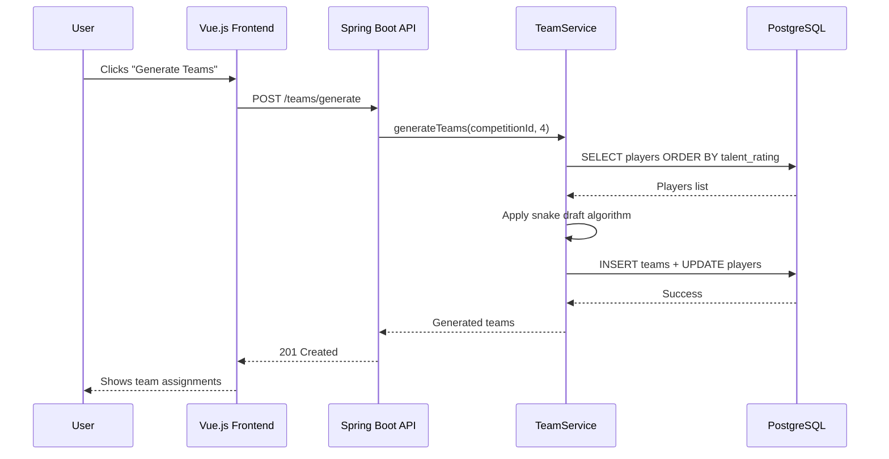
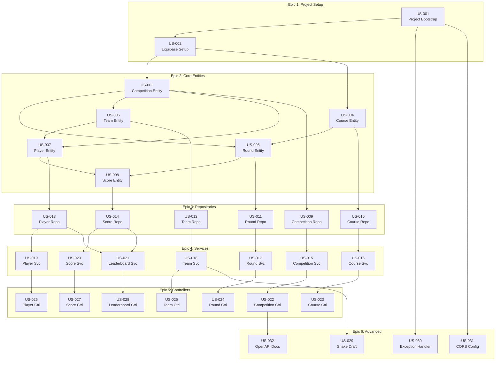
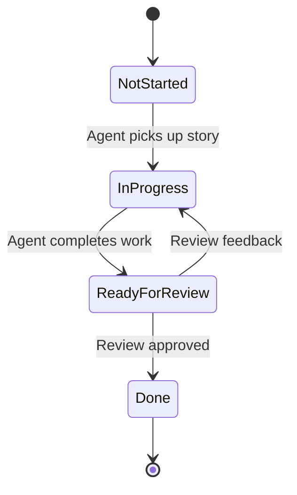

# PRD: Bathe Golf v2 - Backend Implementation

> **Version:** 1.0  
> **Last Updated:** 2026-02-15  
> **Status:** In Progress  
> **Owner:** Development Team

---

## Implementation Tracking

Progress across working sessions. Use this section to pick up where you left off.

### Story Status Summary

| Story | Title | Status |
|-------|-------|--------|
| US-001 | Spring Boot Project Bootstrap | Complete |
| US-002 | Liquibase Setup | Complete |
| US-003 | Competition Entity | Complete |
| US-004 | Course Entity | Complete |
| US-005 | Round Entity | Complete |
| US-006 | Team Entity | Complete |
| US-007 | Player Entity | Complete |
| US-008 | Score Entity | Complete |
| US-009 | Competition Repository | Complete |
| US-010 | Course Repository | Complete |
| US-011 | Round Repository | Complete |
| US-012 | Team Repository | Complete |
| US-013 | Player Repository | Complete |
| US-014 | Score Repository | Complete |
| US-015 | Competition Service | Complete |
| US-016 | Course Service | Complete |
| US-017 | Round Service | Complete |
| US-018 | Team Service | Complete |
| US-019 | Player Service | Complete |
| US-020 | Score Service | Complete |
| US-021 | Leaderboard Service | Complete |
| US-022 | Competition Controller | Complete |
| US-023 | Course Controller | Complete |
| US-024 | Round Controller | Complete |
| US-025 | Team Controller | Complete |
| US-026 | Player Controller | Complete |
| US-027 | Score Controller | Complete |
| US-028 | Leaderboard Controller | Complete |
| US-029 | Snake Draft Algorithm | Not Started |
| US-030 | Global Exception Handler | Not Started |
| US-031 | CORS Configuration | Not Started |
| US-032 | OpenAPI Documentation | Not Started |

### Next Up

**Recommended next stories:** US-029 (Snake Draft), US-030 (Global Exception Handler), US-031 (CORS Config), US-032 (OpenAPI Docs) — all controller dependencies complete (US-022 through US-028 ✓)

### Progress Log

- **2026-02-15:** US-022 through US-028 complete. Created ApiResponse<T> wrapper (success/error factory methods, @JsonInclude(NON_NULL)), GlobalExceptionHandler (@RestControllerAdvice mapping ResourceNotFoundException→404, BusinessRuleException→409, MethodArgumentNotValidException→400), and 7 REST controllers: CompetitionController, CourseController, RoundController, TeamController (including bulk deleteAll), PlayerController (assign/unassign endpoints), ScoreController (upsert pattern), LeaderboardController. All follow /api/v1/... URL convention with correct HTTP status codes (201/200/204). Created 7 @WebMvcTest controller test classes (34 new tests). All 130 backend tests passing.
- **2026-02-15:** US-015 through US-021 complete. Created exception classes (ResourceNotFoundException, BusinessRuleException), 11 request DTOs, 8 response DTOs (including PlayerLeaderboardEntry, TeamLeaderboardEntry), and 7 service classes (CompetitionService, CourseService, RoundService, TeamService, PlayerService, ScoreService, LeaderboardService). All services use constructor injection, @Transactional(readOnly=true) class-level with @Transactional overrides for writes, and throw typed exceptions on not-found/business-rule violations. LeaderboardService ranks players by (roundsPlayed DESC, totalScore ASC) and aggregates team totals. Created 7 Mockito unit test classes (54 new tests). All 96 backend tests passing.
- **2026-02-15:** US-009 through US-014 complete. Created 6 Spring Data JPA repositories: CompetitionRepository, CourseRepository, RoundRepository (with ordered query, find by competition+round number, bulk delete), TeamRepository (with competition list, name uniqueness check, bulk delete), PlayerRepository (with unassigned filter, team filter, talent-rating-ordered query for snake draft, bulk delete), ScoreRepository (with round/competition/player filters, round+player lookup for upsert, bulk delete). Created @DataJpaTest integration tests for all 6 repositories (42 new tests). Fixed H2 reserved-keyword conflict on scores.value column by renaming to score_value in entity and migration.
- **2026-02-15:** US-008 complete. Score entity and migration: Created Score.java entity with Lombok annotations (@Data, @Builder, @NoArgsConstructor, @AllArgsConstructor), UUID primary key, ManyToOne relationships to Competition (denormalized for query efficiency), Round, and Player, Integer value field with @Min(18)/@Max(150) validation, auto-managed timestamps via @PrePersist/@PreUpdate. Created Liquibase migration 006-create-scores-table.xml with foreign keys to competitions, rounds, and players tables, unique constraint on (round_id, player_id), CHECK constraint on value (18-150) for PostgreSQL.
- **2026-02-15:** US-007 complete. Player entity, TalentRating enum, and migration: Created TalentRating.java enum with values A, B, C, D for skill classification. Created Player.java entity with Lombok annotations, UUID primary key, ManyToOne relationships to Competition (required) and Team (nullable), TalentRating enum stored as STRING, BigDecimal fields for entryFee and winnings with defaults of 0, auto-managed timestamps via @PrePersist/@PreUpdate. Created Liquibase migration 005-create-players-table.xml with foreign keys to competitions and teams tables, CHECK constraint on talent_rating (A, B, C, D).
- **2026-02-15:** US-006 complete. Team entity and migration: Created Team.java entity with Lombok annotations (@Data, @Builder, @NoArgsConstructor, @AllArgsConstructor), UUID primary key, ManyToOne relationship to Competition, auto-managed timestamps via @PrePersist/@PreUpdate. Created Liquibase migration 004-create-teams-table.xml with foreign key to competitions table and unique constraint on (competition_id, name).
- **2026-02-15:** US-005 complete. Round entity and migration: Created Round.java entity with Lombok annotations, UUID primary key, ManyToOne relationships to Competition and Course, auto-managed timestamps via @PrePersist/@PreUpdate. Created Liquibase migration 003-create-rounds-table.xml with foreign keys to competitions and courses tables, unique constraint on (competition_id, round_number).
- **2026-02-15:** US-003 complete. Competition entity and migration: Created Competition.java entity with Lombok annotations (@Data, @Builder, @NoArgsConstructor, @AllArgsConstructor), UUID primary key, auto-managed timestamps via @PrePersist/@PreUpdate. Created Liquibase migration 001-create-competitions-table.xml with proper PostgreSQL types and constraints. Added unit tests for entity.
- **2026-02-15:** US-004 complete. Course entity and migration: Created Course.java entity with Lombok annotations, UUID primary key, auto-managed timestamps via @PrePersist/@PreUpdate. Created Liquibase migration 002-create-courses-table.xml with proper PostgreSQL types and constraints.
- **2026-02-15:** US-002 complete. Liquibase setup: Added liquibase-core dependency, configured datasource and Liquibase in application.yml, updated test profile for H2 with Liquibase, created master changelog file.
- **2026-02-15:** US-001 complete. Spring Boot 3.5 project bootstrap: Gradle build, GolfCompApplication, application profiles (dev/test/prod), health actuator, context load test. Root build.gradle updated for monorepo (backendBuild, bootRun, unified build/test/clean).

### Files Modified (Cumulative)

- `spring-golfcomp/build.gradle` — Gradle config, Spring Boot 3.5.3, dependencies, Liquibase
- `spring-golfcomp/src/main/java/com/golfcomp/api/GolfCompApplication.java` — Main class
- `spring-golfcomp/src/main/java/com/golfcomp/api/model/Competition.java` — Competition entity with JPA annotations
- `spring-golfcomp/src/main/java/com/golfcomp/api/model/Course.java` — Course entity with JPA annotations
- `spring-golfcomp/src/main/resources/application.yml` — Default config with datasource and Liquibase
- `spring-golfcomp/src/main/resources/application-dev.yml` — H2 dev profile
- `spring-golfcomp/src/main/resources/application-test.yml` — H2 test profile with Liquibase
- `spring-golfcomp/src/main/resources/application-prod.yml` — Prod profile stub
- `spring-golfcomp/src/main/resources/db/changelog/db.changelog-master.xml` — Liquibase master changelog
- `spring-golfcomp/src/main/resources/db/changelog/changes/001-create-competitions-table.xml` — Competitions table migration
- `spring-golfcomp/src/main/resources/db/changelog/changes/002-create-courses-table.xml` — Courses table migration
- `spring-golfcomp/src/main/java/com/golfcomp/api/model/Round.java` — Round entity with JPA annotations
- `spring-golfcomp/src/main/resources/db/changelog/changes/003-create-rounds-table.xml` — Rounds table migration
- `spring-golfcomp/src/main/java/com/golfcomp/api/model/Team.java` — Team entity with JPA annotations
- `spring-golfcomp/src/main/resources/db/changelog/changes/004-create-teams-table.xml` — Teams table migration
- `spring-golfcomp/src/main/java/com/golfcomp/api/model/TalentRating.java` — TalentRating enum (A, B, C, D)
- `spring-golfcomp/src/main/java/com/golfcomp/api/model/Player.java` — Player entity with JPA annotations
- `spring-golfcomp/src/main/resources/db/changelog/changes/005-create-players-table.xml` — Players table migration
- `spring-golfcomp/src/main/java/com/golfcomp/api/model/Score.java` — Score entity with JPA annotations
- `spring-golfcomp/src/main/resources/db/changelog/changes/006-create-scores-table.xml` — Scores table migration
- `spring-golfcomp/src/test/java/com/golfcomp/api/GolfCompApplicationTests.java` — Context load test
- `spring-golfcomp/src/test/java/com/golfcomp/api/model/CompetitionTest.java` — Competition entity unit tests
- `spring-golfcomp/README.md` — Backend readme
- `settings.gradle` — Include spring-golfcomp subproject
- `build.gradle` — Backend tasks, bootRun, unified build/test/clean
- `spring-golfcomp/src/main/java/com/golfcomp/api/repository/CompetitionRepository.java` — Competition JPA repository
- `spring-golfcomp/src/main/java/com/golfcomp/api/repository/CourseRepository.java` — Course JPA repository (findByName)
- `spring-golfcomp/src/main/java/com/golfcomp/api/repository/RoundRepository.java` — Round JPA repository (ordered query, find by competition+round, bulk delete)
- `spring-golfcomp/src/main/java/com/golfcomp/api/repository/TeamRepository.java` — Team JPA repository (by competition, name uniqueness, bulk delete)
- `spring-golfcomp/src/main/java/com/golfcomp/api/repository/PlayerRepository.java` — Player JPA repository (unassigned filter, talent-rating order, team filter, count, bulk delete)
- `spring-golfcomp/src/main/java/com/golfcomp/api/repository/ScoreRepository.java` — Score JPA repository (round/player/competition filters, upsert lookup, bulk delete)
- `spring-golfcomp/src/test/java/com/golfcomp/api/integration/CompetitionRepositoryTest.java` — Competition repository integration tests
- `spring-golfcomp/src/test/java/com/golfcomp/api/integration/CourseRepositoryTest.java` — Course repository integration tests
- `spring-golfcomp/src/test/java/com/golfcomp/api/integration/RoundRepositoryTest.java` — Round repository integration tests
- `spring-golfcomp/src/test/java/com/golfcomp/api/integration/TeamRepositoryTest.java` — Team repository integration tests
- `spring-golfcomp/src/test/java/com/golfcomp/api/integration/PlayerRepositoryTest.java` — Player repository integration tests
- `spring-golfcomp/src/test/java/com/golfcomp/api/integration/ScoreRepositoryTest.java` — Score repository integration tests
- `spring-golfcomp/src/main/java/com/golfcomp/api/model/Score.java` — Fixed: column renamed to score_value (was reserved word in H2)
- `spring-golfcomp/src/main/resources/db/changelog/changes/006-create-scores-table.xml` — Fixed: column renamed to score_value
- `spring-golfcomp/src/main/resources/application-test.yml` — Added NON_KEYWORDS=VALUE to H2 URL (belt-and-suspenders)

---

## Table of Contents

0. [Implementation Tracking](#implementation-tracking)
1. [Executive Summary](#1-executive-summary)
2. [Goals & Success Metrics](#2-goals--success-metrics)
3. [Target Audience](#3-target-audience)
4. [Technical Foundation](#4-technical-foundation)
5. [Architecture Overview](#5-architecture-overview)
6. [Data Model](#6-data-model)
7. [API Contracts](#7-api-contracts)
8. [User Flows](#8-user-flows)
9. [Story Dependency Graph](#9-story-dependency-graph)
10. [User Stories](#10-user-stories)
11. [Technical Glossary](#11-technical-glossary)
12. [Security Considerations](#12-security-considerations)
13. [Future Considerations](#13-future-considerations)

---

## 1. Executive Summary

### 1.1 Problem Statement

The current Bathe Golf Competition application is a Vue.js 2 SPA that stores all data in localStorage. While functional for single-user scenarios, this architecture has significant limitations:

- **Data Loss Risk**: localStorage can be cleared by browser settings, cache clearing, or device changes
- **No Multi-Device Support**: Data is trapped on a single browser/device
- **No Collaboration**: Multiple users cannot view or manage the same competition
- **Limited Scalability**: Cannot support multiple concurrent competitions
- **No Data Backup**: No server-side persistence or recovery options
- **Static Courses**: Courses are hardcoded rather than configurable per competition

### 1.2 Proposed Solution

Implement a Spring Boot backend with PostgreSQL database to provide:

- **Persistent Storage**: Server-side data persistence with PostgreSQL
- **Competition Context**: New Competition entity as the organizing container for all data
- **Expanded Data Model**: Support for Rounds (scheduled course play dates), dynamic Courses, and enhanced Score tracking
- **RESTful API**: Clean API contracts for the existing Vue.js frontend to consume
- **Data Migration Path**: Strategy for migrating existing localStorage data
- **Liquibase Migrations**: Version-controlled database schema management

### 1.3 Scope

**In Scope:**
- Spring Boot backend application setup
- PostgreSQL database with Liquibase migrations
- JPA entities for: Competition, Round, Course, Player, Team, Score
- Repository layer for all entities
- Service layer with business logic (including snake draft algorithm)
- REST API endpoints for CRUD operations
- Leaderboard calculation endpoints
- Data validation and error handling
- Unit and integration tests

**Out of Scope:**
- Frontend modifications (separate PRD)
- User authentication/authorization (future phase)
- Multi-tenancy support
- Real-time updates (WebSockets)
- Mobile applications
- Cloud deployment configuration

### 1.4 Monorepo Context

**This PRD describes work that must be implemented within the golf-competition-app monorepo.** The repository is organized as follows:

| Folder | Purpose |
|--------|---------|
| `vue-golfcomp/` | Existing Vue.js frontend (client-side SPA) |
| `spring-golfcomp/` | **Backend artifacts** — all Spring Boot code, configuration, and resources described in this PRD |

The root of the repository contains Gradle orchestration (`build.gradle`, `settings.gradle`) that coordinates both the frontend and backend. All backend software artifacts—Java source code, application configuration, Liquibase migrations, tests, and build configuration—**must be placed in the `spring-golfcomp/` folder**. This aligns with the monorepo pattern used in similar projects (e.g., tv-bingo with `spring-tvbingo` and `vue-tvbingo`).

---

## 2. Goals & Success Metrics

| Goal | Metric | Target |
|------|--------|--------|
| Data Persistence | Data survives browser refresh/clear | 100% |
| API Response Time | Average endpoint response | < 200ms |
| Test Coverage | Backend code coverage | ≥ 80% |
| Schema Migrations | Liquibase changesets execute cleanly | 100% |
| API Parity | All current localStorage operations have API equivalents | 100% |

---

## 3. Target Audience

### 3.1 Primary Users

**Golf Trip Organizers**: Individuals who organize golf competitions for groups (typically 8-32 players). They need to:
- Create and configure competitions
- Manage player registrations
- Generate balanced teams
- Enter and track scores across multiple rounds
- View leaderboards

### 3.2 Secondary Users

**AI Development Agents**: Automated coding assistants that will implement the user stories in this PRD. The stories are structured with explicit agent instructions.

---

## 4. Technical Foundation

### 4.1 Global Tech Stack

> These are the default technologies. Individual stories may override specific choices.

| Layer                 | Technology         | Version | Notes                       |
| --------------------- | ------------------ | ------- | --------------------------- |
| **Backend Language**  | Java               | 21      | LTS version                 |
| **Backend Framework** | Spring Boot        | 3.5.x   | Spring Web, Spring Data JPA |
| **Database**          | PostgreSQL         | 16.x    | Primary data store          |
| **DB Migrations**     | Liquibase          | 4.25.x  | XML or YAML changesets      |
| **ORM**               | Hibernate          | 6.x     | Via Spring Data JPA         |
| **Build Tool**        | Gradle             | 8.x     | Gradle 8.x                  |
| **Testing**           | JUnit 5            | 5.10.x  | With Mockito                |
| **API Docs**          | SpringDoc OpenAPI  | 2.3.x   | Swagger UI                  |
| **Validation**        | Jakarta Validation | 3.0.x   | Bean validation             |
| **Lombok**            | Lombok             | 1.18.x  | Reduce boilerplate          |

### 4.2 Development Standards

| Aspect | Standard |
|--------|----------|
| **Code Style** | Google Java Style Guide |
| **Branch Strategy** | Feature branches with PR to main |
| **Commit Convention** | `<type>: <subject>` (Add, Update, Fix, Refactor, Docs, Test) |
| **PR Requirements** | All tests passing, no linting errors, self-review completed |

### 4.3 Project Structure

All backend artifacts live under `spring-golfcomp/` at the repository root. The full monorepo layout:

```
golf-competition-app/           # Repository root (monorepo)
├── vue-golfcomp/              # Vue.js frontend (existing)
├── spring-golfcomp/           # Backend — all artifacts described in this PRD
│   ├── src/
│   │   ├── main/
│   │   │   ├── java/com/golfcomp/api/
│   │   │   │   ├── GolfCompApplication.java
│   │   │   │   ├── config/
│   │   │   │   │   ├── CorsConfig.java
│   │   │   │   │   └── OpenApiConfig.java
│   │   │   │   ├── controller/
│   │   │   │   │   ├── CompetitionController.java
│   │   │   │   │   ├── RoundController.java
│   │   │   │   │   ├── CourseController.java
│   │   │   │   │   ├── PlayerController.java
│   │   │   │   │   ├── TeamController.java
│   │   │   │   │   ├── ScoreController.java
│   │   │   │   │   └── LeaderboardController.java
│   │   │   │   ├── service/
│   │   │   │   │   ├── CompetitionService.java
│   │   │   │   │   ├── RoundService.java
│   │   │   │   │   ├── CourseService.java
│   │   │   │   │   ├── PlayerService.java
│   │   │   │   │   ├── TeamService.java
│   │   │   │   │   ├── ScoreService.java
│   │   │   │   │   └── LeaderboardService.java
│   │   │   │   ├── repository/
│   │   │   │   │   ├── CompetitionRepository.java
│   │   │   │   │   ├── RoundRepository.java
│   │   │   │   │   ├── CourseRepository.java
│   │   │   │   │   ├── PlayerRepository.java
│   │   │   │   │   ├── TeamRepository.java
│   │   │   │   │   └── ScoreRepository.java
│   │   │   │   ├── model/
│   │   │   │   │   ├── Competition.java
│   │   │   │   │   ├── Round.java
│   │   │   │   │   ├── Course.java
│   │   │   │   │   ├── Player.java
│   │   │   │   │   ├── Team.java
│   │   │   │   │   ├── Score.java
│   │   │   │   │   └── TalentRating.java
│   │   │   │   ├── dto/
│   │   │   │   │   ├── request/
│   │   │   │   │   │   └── [Request DTOs]
│   │   │   │   │   └── response/
│   │   │   │   │       └── [Response DTOs]
│   │   │   │   └── exception/
│   │   │   │       ├── GlobalExceptionHandler.java
│   │   │   │       └── [Custom Exceptions]
│   │   │   └── resources/
│   │   │       ├── application.yml
│   │   │       ├── application-dev.yml
│   │   │       ├── application-test.yml
│   │   │       └── db/
│   │   │           └── changelog/
│   │   │               ├── db.changelog-master.xml
│   │   │               └── changes/
│   │   │                   └── [Migration files]
│   │   └── test/
│   │       └── java/com/golfcomp/api/
│   │           ├── unit/
│   │           └── integration/
│   ├── build.gradle
│   └── README.md
├── build.gradle               # Root Gradle orchestration
├── settings.gradle
└── ...
```

### 4.4 Naming Conventions

| Element | Convention | Example |
|---------|------------|---------|
| **Java Classes** | PascalCase | `CompetitionService`, `PlayerController` |
| **Java Methods** | camelCase | `findByCompetitionId()`, `generateTeams()` |
| **Java Constants** | SCREAMING_SNAKE | `MAX_SCORE`, `MIN_TEAMS` |
| **Database Tables** | snake_case, plural | `competitions`, `players`, `scores` |
| **Database Columns** | snake_case | `talent_rating`, `play_date`, `created_at` |
| **API Endpoints** | kebab-case, plural | `/api/v1/competitions`, `/api/v1/players` |
| **Liquibase Files** | `NNN-description.xml` | `001-create-competitions-table.xml` |

---

## 5. Architecture Overview

### 5.1 System Architecture Diagram



### 5.2 Component Descriptions

| Component | Purpose | Technology |
|-----------|---------|------------|
| Vue.js SPA | Existing frontend application | Vue 2, Vuex, Vue Router |
| REST Controllers | HTTP request handling, input validation | Spring Web MVC |
| Business Services | Domain logic, team generation, leaderboards | Spring Service beans |
| Repositories | Data access abstraction | Spring Data JPA |
| PostgreSQL | Persistent data storage | PostgreSQL 16 |
| Liquibase | Database version control and migrations | Liquibase 4.25 |

---

## 6. Data Model

### 6.1 Entity Relationship Diagram



### 6.2 Entity Definitions

#### COMPETITION

| Field | Type | Constraints | Description |
|-------|------|-------------|-------------|
| `id` | UUID | PK, NOT NULL | Unique identifier |
| `name` | VARCHAR(255) | NOT NULL | Competition name, e.g., "2026 Bathe Golf Competition" |
| `start_date` | DATE | NOT NULL | Competition start date |
| `end_date` | DATE | NOT NULL | Competition end date |
| `location` | VARCHAR(255) | NULL | General location, e.g., "Legends at Myrtle Beach" |
| `created_at` | TIMESTAMP | NOT NULL, DEFAULT NOW() | Record creation time |
| `updated_at` | TIMESTAMP | NOT NULL | Last update time |

#### COURSE

| Field | Type | Constraints | Description |
|-------|------|-------------|-------------|
| `id` | UUID | PK, NOT NULL | Unique identifier |
| `name` | VARCHAR(100) | NOT NULL | Course name, e.g., "Heathland" |
| `facility` | VARCHAR(255) | NULL | Facility name, e.g., "Legends" |
| `location` | VARCHAR(255) | NULL | Course location, e.g., "Myrtle Beach, NC" |
| `created_at` | TIMESTAMP | NOT NULL, DEFAULT NOW() | Record creation time |
| `updated_at` | TIMESTAMP | NOT NULL | Last update time |

#### ROUND

| Field | Type | Constraints | Description |
|-------|------|-------------|-------------|
| `id` | UUID | PK, NOT NULL | Unique identifier |
| `competition_id` | UUID | FK, NOT NULL | Reference to competition |
| `course_id` | UUID | FK, NOT NULL | Reference to course being played |
| `play_date` | DATE | NOT NULL | Date the round is played |
| `round_number` | INT | NOT NULL | Sequential round number (1, 2, 3...) |
| `created_at` | TIMESTAMP | NOT NULL, DEFAULT NOW() | Record creation time |
| `updated_at` | TIMESTAMP | NOT NULL | Last update time |

**Unique Constraint:** (competition_id, round_number)

#### TEAM

| Field | Type | Constraints | Description |
|-------|------|-------------|-------------|
| `id` | UUID | PK, NOT NULL | Unique identifier |
| `competition_id` | UUID | FK, NOT NULL | Reference to competition |
| `name` | VARCHAR(100) | NOT NULL | Team name, e.g., "Bathe's Bombers" |
| `logo_url` | TEXT | NULL | Base64 data URL or external URL |
| `created_at` | TIMESTAMP | NOT NULL, DEFAULT NOW() | Record creation time |
| `updated_at` | TIMESTAMP | NOT NULL | Last update time |

**Unique Constraint:** (competition_id, name)

#### PLAYER

| Field | Type | Constraints | Description |
|-------|------|-------------|-------------|
| `id` | UUID | PK, NOT NULL | Unique identifier |
| `competition_id` | UUID | FK, NOT NULL | Reference to competition |
| `team_id` | UUID | FK, NULL | Reference to team (null if unassigned) |
| `name` | VARCHAR(100) | NOT NULL | Player name, e.g., "Erik Bathe" |
| `talent_rating` | VARCHAR(1) | NOT NULL, CHECK(A,B,C,D) | Skill rating for team balancing |
| `entry_fee` | DECIMAL(10,2) | DEFAULT 0 | Entry fee paid |
| `winnings` | DECIMAL(10,2) | DEFAULT 0 | Prize money won |
| `created_at` | TIMESTAMP | NOT NULL, DEFAULT NOW() | Record creation time |
| `updated_at` | TIMESTAMP | NOT NULL | Last update time |

#### SCORE

| Field | Type | Constraints | Description |
|-------|------|-------------|-------------|
| `id` | UUID | PK, NOT NULL | Unique identifier |
| `competition_id` | UUID | FK, NOT NULL | Denormalized for query efficiency |
| `round_id` | UUID | FK, NOT NULL | Reference to round |
| `player_id` | UUID | FK, NOT NULL | Reference to player |
| `value` | INT | NOT NULL, CHECK(18-150) | Score value (strokes) |
| `created_at` | TIMESTAMP | NOT NULL, DEFAULT NOW() | Record creation time |
| `updated_at` | TIMESTAMP | NOT NULL | Last update time |

**Unique Constraint:** (round_id, player_id) - One score per player per round

---

## 7. API Contracts

### 7.1 API Versioning

All APIs are versioned using URL path versioning: `/api/v1/...`

### 7.2 Standard Response Format

**Success Response:**
```json
{
  "success": true,
  "data": { },
  "meta": {
    "timestamp": "2026-01-31T10:30:00Z",
    "requestId": "uuid"
  }
}
```

**Error Response:**
```json
{
  "success": false,
  "error": {
    "code": "ERROR_CODE",
    "message": "Human readable message",
    "details": { }
  },
  "meta": {
    "timestamp": "2026-01-31T10:30:00Z",
    "requestId": "uuid"
  }
}
```

### 7.3 Competition Endpoints

| Method | Endpoint | Purpose |
|--------|----------|---------|
| POST | `/api/v1/competitions` | Create competition |
| GET | `/api/v1/competitions` | List all competitions |
| GET | `/api/v1/competitions/{id}` | Get competition by ID |
| PUT | `/api/v1/competitions/{id}` | Update competition |
| DELETE | `/api/v1/competitions/{id}` | Delete competition |

### 7.4 Course Endpoints

| Method | Endpoint | Purpose |
|--------|----------|---------|
| POST | `/api/v1/courses` | Create course |
| GET | `/api/v1/courses` | List all courses |
| GET | `/api/v1/courses/{id}` | Get course by ID |
| PUT | `/api/v1/courses/{id}` | Update course |
| DELETE | `/api/v1/courses/{id}` | Delete course |

### 7.5 Round Endpoints

| Method | Endpoint | Purpose |
|--------|----------|---------|
| POST | `/api/v1/competitions/{competitionId}/rounds` | Create round |
| GET | `/api/v1/competitions/{competitionId}/rounds` | List rounds |
| GET | `/api/v1/competitions/{competitionId}/rounds/{id}` | Get round |
| DELETE | `/api/v1/competitions/{competitionId}/rounds/{id}` | Delete round |

### 7.6 Player Endpoints

| Method | Endpoint | Purpose |
|--------|----------|---------|
| POST | `/api/v1/competitions/{competitionId}/players` | Add player |
| GET | `/api/v1/competitions/{competitionId}/players` | List players |
| GET | `/api/v1/competitions/{competitionId}/players/{id}` | Get player |
| PUT | `/api/v1/competitions/{competitionId}/players/{id}` | Update player |
| PUT | `/api/v1/competitions/{competitionId}/players/{id}/assign` | Assign to team |
| PUT | `/api/v1/competitions/{competitionId}/players/{id}/unassign` | Remove from team |
| DELETE | `/api/v1/competitions/{competitionId}/players/{id}` | Delete player |

### 7.7 Team Endpoints

| Method | Endpoint | Purpose |
|--------|----------|---------|
| POST | `/api/v1/competitions/{competitionId}/teams` | Create team |
| GET | `/api/v1/competitions/{competitionId}/teams` | List teams |
| GET | `/api/v1/competitions/{competitionId}/teams/{id}` | Get team with players |
| PUT | `/api/v1/competitions/{competitionId}/teams/{id}` | Update team |
| DELETE | `/api/v1/competitions/{competitionId}/teams/{id}` | Delete team |
| POST | `/api/v1/competitions/{competitionId}/teams/generate` | Auto-generate teams |
| DELETE | `/api/v1/competitions/{competitionId}/teams` | Delete all teams |

### 7.8 Score Endpoints

| Method | Endpoint | Purpose |
|--------|----------|---------|
| PUT | `/api/v1/competitions/{competitionId}/rounds/{roundId}/scores` | Upsert score |
| GET | `/api/v1/competitions/{competitionId}/rounds/{roundId}/scores` | Get round scores |
| DELETE | `/api/v1/competitions/{competitionId}/scores` | Delete all scores |

### 7.9 Leaderboard Endpoints

| Method | Endpoint | Purpose |
|--------|----------|---------|
| GET | `/api/v1/competitions/{competitionId}/leaderboards/players` | Player rankings |
| GET | `/api/v1/competitions/{competitionId}/leaderboards/teams` | Team rankings |

### 7.10 Error Codes

| Code | HTTP Status | Description |
|------|-------------|-------------|
| `COMPETITION_NOT_FOUND` | 404 | Competition ID does not exist |
| `PLAYER_NOT_FOUND` | 404 | Player ID does not exist |
| `TEAM_NOT_FOUND` | 404 | Team ID does not exist |
| `ROUND_NOT_FOUND` | 404 | Round ID does not exist |
| `COURSE_NOT_FOUND` | 404 | Course ID does not exist |
| `DUPLICATE_TEAM_NAME` | 409 | Team name already exists in competition |
| `INVALID_TALENT_RATING` | 400 | Rating must be A, B, C, or D |
| `INVALID_SCORE_VALUE` | 400 | Score must be between 18 and 150 |
| `INSUFFICIENT_PLAYERS` | 400 | Not enough players to generate teams |

---

## 8. User Flows

### 8.1 Competition Setup Flow



### 8.2 Team Generation Flow



---

## 9. Story Dependency Graph



**Legend:**
- 🟩 Green: Done
- 🟨 Yellow: In Progress  
- ⬜ White: Not Started

---

## 10. User Stories

> **Path convention:** All file paths in the user stories below are relative to the `spring-golfcomp/` folder. When implementing, create or modify files under `spring-golfcomp/` (e.g., `spring-golfcomp/build.gradle`, `spring-golfcomp/src/main/java/...`).

### US-001: Spring Boot Project Bootstrap

| Attribute | Value |
|-----------|-------|
| **Status** | `Complete` |
| **Type** | `Backend` |
| **Estimated Effort** | ~2 hours |
| **Epic** | Project Setup |
| **Priority** | P0 (Critical) |

#### Description

As a developer, I want a properly configured Spring Boot 3.5 project so that I have a foundation to build the API.

#### Prerequisites

| Story ID | Title | Status |
|----------|-------|--------|
| — | No prerequisites | ✓ |

#### Acceptance Criteria

- [x] AC1: Gradle project with Spring Boot 3.5.x parent
- [x] AC2: Dependencies include: Spring Web, Spring Data JPA, PostgreSQL driver, Lombok, Validation, SpringDoc OpenAPI
- [x] AC3: Application starts successfully on port 8080
- [x] AC4: Health check endpoint returns 200 OK at `/actuator/health`
- [x] AC5: Application profiles configured (dev, test, prod)

#### Agent Instructions

**🎯 Objective:**
Create a new Spring Boot 3.5 Gradle project with all required dependencies and configuration files.

**📁 Files to Create/Modify:**

| Action | File Path | Purpose |
|--------|-----------|---------|
| CREATE | `build.gradle` | Gradle build configuration |
| CREATE | `src/main/java/com/golfcomp/api/GolfCompApplication.java` | Main application class |
| CREATE | `src/main/resources/application.yml` | Default configuration |
| CREATE | `src/main/resources/application-dev.yml` | Development profile |
| CREATE | `src/main/resources/application-test.yml` | Test profile |

**🚫 Constraints:**
- DO NOT add any entity or business logic code
- DO NOT configure database connection (Liquibase story handles this)

**📤 Expected Output:**
- [x] Project compiles with `./gradlew clean compile` (from repository root or `spring-golfcomp/`)
- [x] Application starts with `./gradlew bootRun` (from repository root)
- [x] Health endpoint accessible

#### Testing Requirements

| Test Type | Location |
|-----------|----------|
| Unit | `src/test/java/com/golfcomp/api/GolfCompApplicationTests.java` |

#### Definition of Done

- [x] All acceptance criteria met
- [x] All tests written and passing
- [x] Code compiles with no errors
- [x] Ready for human code review

---

### US-002: Liquibase Setup and Database Configuration

| Attribute | Value |
|-----------|-------|
| **Status** | `Complete` |
| **Type** | `Backend` |
| **Estimated Effort** | ~1.5 hours |
| **Epic** | Project Setup |
| **Priority** | P0 (Critical) |

#### Description

As a developer, I want Liquibase configured for database migrations so that schema changes are version-controlled and repeatable.

#### Prerequisites

| Story ID | Title | Status |
|----------|-------|--------|
| US-001 | Spring Boot Project Bootstrap | ✓ Complete |

#### Acceptance Criteria

- [x] AC1: Liquibase configured in application.yml
- [x] AC2: Master changelog file exists and loads
- [x] AC3: Application connects to PostgreSQL on startup
- [x] AC4: Test profile uses H2 in-memory database

#### Agent Instructions

**📁 Files to Create/Modify:**

| Action | File Path | Purpose |
|--------|-----------|---------|
| MODIFY | `src/main/resources/application.yml` | Add datasource and Liquibase config |
| MODIFY | `src/main/resources/application-test.yml` | H2 test database settings |
| CREATE | `src/main/resources/db/changelog/db.changelog-master.xml` | Master changelog |

**📤 Expected Output:**
- [x] Application starts and connects to PostgreSQL
- [x] Liquibase creates its tracking tables

---

### US-003: Competition Entity and Migration

| Attribute | Value |
|-----------|-------|
| **Status** | `Complete` |
| **Type** | `Backend` |
| **Estimated Effort** | ~1.5 hours |
| **Epic** | Core Entities |
| **Priority** | P0 (Critical) |

#### Description

As a developer, I want a Competition entity and database table so that competitions can be persisted as the organizing container for all golf data.

#### Prerequisites

| Story ID | Title | Status |
|----------|-------|--------|
| US-002 | Liquibase Setup | Required |

#### Acceptance Criteria

- [x] AC1: Competition entity class with all fields from data model
- [x] AC2: Liquibase migration creates `competitions` table
- [x] AC3: JPA annotations properly configured
- [x] AC4: Timestamps auto-managed via @PrePersist/@PreUpdate

#### Agent Instructions

**📁 Files to Create/Modify:**

| Action | File Path | Purpose |
|--------|-----------|---------|
| CREATE | `src/main/java/com/golfcomp/api/model/Competition.java` | Entity class |
| CREATE | `src/main/resources/db/changelog/changes/001-create-competitions-table.xml` | Migration |

**💡 Hints:**
- Use Lombok `@Data`, `@Builder`, `@NoArgsConstructor`, `@AllArgsConstructor`
- Use `@GeneratedValue(strategy = GenerationType.UUID)`

---

### US-004: Course Entity and Migration

| Attribute | Value |
|-----------|-------|
| **Status** | `Complete` |
| **Type** | `Backend` |
| **Estimated Effort** | ~1 hour |
| **Epic** | Core Entities |
| **Priority** | P0 (Critical) |

#### Prerequisites

| Story ID | Title | Status |
|----------|-------|--------|
| US-002 | Liquibase Setup | Required |

#### Agent Instructions

**📁 Files to Create/Modify:**

| Action | File Path | Purpose |
|--------|-----------|---------|
| CREATE | `src/main/java/com/golfcomp/api/model/Course.java` | Entity class |
| CREATE | `src/main/resources/db/changelog/changes/002-create-courses-table.xml` | Migration |

---

### US-005: Round Entity and Migration

| Attribute | Value |
|-----------|-------|
| **Status** | `Complete` |
| **Type** | `Backend` |
| **Estimated Effort** | ~1.5 hours |
| **Epic** | Core Entities |
| **Priority** | P0 (Critical) |

#### Prerequisites

| Story ID | Title | Status |
|----------|-------|--------|
| US-003 | Competition Entity | Required |
| US-004 | Course Entity | Required |

#### Agent Instructions

**📁 Files to Create/Modify:**

| Action | File Path | Purpose |
|--------|-----------|---------|
| CREATE | `src/main/java/com/golfcomp/api/model/Round.java` | Entity class |
| CREATE | `src/main/resources/db/changelog/changes/003-create-rounds-table.xml` | Migration |

**💡 Hints:**
- ManyToOne relationships to Competition and Course
- Unique constraint on (competition_id, round_number)

---

### US-006: Team Entity and Migration

| Attribute | Value |
|-----------|-------|
| **Status** | `Complete` |
| **Type** | `Backend` |
| **Estimated Effort** | ~1 hour |
| **Epic** | Core Entities |
| **Priority** | P0 (Critical) |

#### Prerequisites

| Story ID | Title | Status |
|----------|-------|--------|
| US-003 | Competition Entity | Required |

#### Agent Instructions

**📁 Files to Create/Modify:**

| Action | File Path | Purpose |
|--------|-----------|---------|
| CREATE | `src/main/java/com/golfcomp/api/model/Team.java` | Entity class |
| CREATE | `src/main/resources/db/changelog/changes/004-create-teams-table.xml` | Migration |

---

### US-007: Player Entity, TalentRating Enum, and Migration

| Attribute | Value |
|-----------|-------|
| **Status** | `Complete` |
| **Type** | `Backend` |
| **Estimated Effort** | ~2 hours |
| **Epic** | Core Entities |
| **Priority** | P0 (Critical) |

#### Prerequisites

| Story ID | Title | Status |
|----------|-------|--------|
| US-003 | Competition Entity | Required |
| US-006 | Team Entity | Required |

#### Acceptance Criteria

- [x] AC1: TalentRating enum with values A, B, C, D
- [x] AC2: Player entity with competition and optional team relationships
- [x] AC3: Entry fee and winnings default to 0

#### Agent Instructions

**📁 Files to Create/Modify:**

| Action | File Path | Purpose |
|--------|-----------|---------|
| CREATE | `src/main/java/com/golfcomp/api/model/TalentRating.java` | Enum |
| CREATE | `src/main/java/com/golfcomp/api/model/Player.java` | Entity class |
| CREATE | `src/main/resources/db/changelog/changes/005-create-players-table.xml` | Migration |

**💡 Hints:**
- Team relationship is nullable (players start unassigned)
- Use BigDecimal for monetary fields

---

### US-008: Score Entity and Migration

| Attribute | Value |
|-----------|-------|
| **Status** | `Complete` |
| **Type** | `Backend` |
| **Estimated Effort** | ~1.5 hours |
| **Epic** | Core Entities |
| **Priority** | P0 (Critical) |

#### Prerequisites

| Story ID | Title | Status |
|----------|-------|--------|
| US-005 | Round Entity | Required |
| US-007 | Player Entity | Required |

#### Acceptance Criteria

- [x] AC1: Score entity with round and player relationships
- [x] AC2: Value validated between 18 and 150
- [x] AC3: Unique constraint on (round_id, player_id)

#### Agent Instructions

**📁 Files to Create/Modify:**

| Action | File Path | Purpose |
|--------|-----------|---------|
| CREATE | `src/main/java/com/golfcomp/api/model/Score.java` | Entity class |
| CREATE | `src/main/resources/db/changelog/changes/006-create-scores-table.xml` | Migration |

---

### US-009 through US-014: Repository Stories

Create Spring Data JPA repositories for each entity following the pattern:

```java
public interface [Entity]Repository extends JpaRepository<[Entity], UUID> {
    // Custom query methods
}
```

---

### US-015 through US-021: Service Stories

Create service classes with business logic for each entity, including:
- CRUD operations
- Validation logic
- DTO mapping
- LeaderboardService for ranking calculations

---

### US-022 through US-028: Controller Stories

Create REST controllers following the API contracts in Section 7.

---

### US-029: Team Generation Algorithm (Snake Draft)

| Attribute | Value |
|-----------|-------|
| **Status** | `Not Started` |
| **Type** | `Backend` |
| **Estimated Effort** | ~3 hours |
| **Epic** | Advanced Features |
| **Priority** | P0 (Critical) |

#### Description

As a developer, I want the snake draft team generation algorithm implemented so that balanced teams are created automatically.

#### Prerequisites

| Story ID | Title | Status |
|----------|-------|--------|
| US-018 | Team Service | Required |
| US-019 | Player Service | Required |

#### Acceptance Criteria

- [ ] AC1: Creates N teams with auto-generated names
- [ ] AC2: Sorts players by talent rating (A → B → C → D)
- [ ] AC3: Distributes using snake draft pattern
- [ ] AC4: Handles uneven player counts
- [ ] AC5: Clears existing teams before generating

#### Technical Specifications

**Snake Draft Algorithm (from CLAUDE.md):**
1. Sort players by talent rating (A → B → C → D)
2. Distribute round-robin with alternating direction:
   - Round 1: Team1, Team2, Team3, Team4
   - Round 2: Team4, Team3, Team2, Team1 (reverse)
   - Round 3: Team1, Team2, Team3, Team4
   - etc.

**Example with 16 players and 4 teams:**
```
Round 1 (A players): T1-A1, T2-A2, T3-A3, T4-A4
Round 2 (B players): T4-B1, T3-B2, T2-B3, T1-B4
Round 3 (C players): T1-C1, T2-C2, T3-C3, T4-C4
Round 4 (D players): T4-D1, T3-D2, T2-D3, T1-D4
```

Result: Each team has one of each rating.

#### Agent Instructions

**📁 Files to Create/Modify:**

| Action | File Path | Purpose |
|--------|-----------|---------|
| MODIFY | `src/main/java/com/golfcomp/api/service/TeamService.java` | Add generateTeams method |
| CREATE | `src/main/java/com/golfcomp/api/dto/request/GenerateTeamsRequest.java` | Request DTO |

**📖 Reference Files:**
- See existing Vue implementation in `src/store/modules/teams.js:72-93` (CLAUDE.md reference)

---

### US-030: Global Exception Handler

| Attribute | Value |
|-----------|-------|
| **Status** | `Not Started` |
| **Type** | `Backend` |
| **Estimated Effort** | ~1.5 hours |
| **Epic** | Advanced Features |
| **Priority** | P1 (High) |

#### Agent Instructions

**📁 Files to Create/Modify:**

| Action | File Path | Purpose |
|--------|-----------|---------|
| CREATE | `src/main/java/com/golfcomp/api/exception/GlobalExceptionHandler.java` | @ControllerAdvice |
| CREATE | `src/main/java/com/golfcomp/api/exception/ResourceNotFoundException.java` | 404 |
| CREATE | `src/main/java/com/golfcomp/api/exception/ValidationException.java` | 400 |
| CREATE | `src/main/java/com/golfcomp/api/exception/BusinessRuleException.java` | 409 |

---

### US-031: CORS Configuration

| Attribute | Value |
|-----------|-------|
| **Status** | `Not Started` |
| **Type** | `Backend` |
| **Estimated Effort** | ~30 minutes |
| **Epic** | Advanced Features |
| **Priority** | P1 (High) |

#### Agent Instructions

**📁 Files to Create/Modify:**

| Action | File Path | Purpose |
|--------|-----------|---------|
| CREATE | `src/main/java/com/golfcomp/api/config/CorsConfig.java` | CORS config |

---

### US-032: OpenAPI Documentation

| Attribute | Value |
|-----------|-------|
| **Status** | `Not Started` |
| **Type** | `Backend` |
| **Estimated Effort** | ~1 hour |
| **Epic** | Advanced Features |
| **Priority** | P2 (Medium) |

#### Agent Instructions

**📁 Files to Create/Modify:**

| Action | File Path | Purpose |
|--------|-----------|---------|
| CREATE | `src/main/java/com/golfcomp/api/config/OpenApiConfig.java` | Swagger config |

---

## 11. Technical Glossary

| Term | Definition |
|------|------------|
| **Competition** | A golf trip/event containing rounds, teams, players, and scores |
| **Round** | A single playing of a golf course by all players on a specific date |
| **Course** | A golf course where rounds are played |
| **Team** | A named group of players competing together |
| **Player** | An individual golfer participating in a competition |
| **Score** | The number of strokes a player took during a round (18-150) |
| **Talent Rating** | Player skill classification (A, B, C, D) used for team balancing |
| **Snake Draft** | Algorithm that distributes players to teams in alternating order for balance |
| **Entity** | A JPA-annotated class representing a database table |
| **DTO** | Data Transfer Object - used for API request/response bodies |
| **Repository** | Spring Data interface for database operations |
| **Service** | Business logic layer between controller and repository |
| **Liquibase** | Database migration tool for version-controlled schema changes |

---

## 12. Security Considerations

### 12.1 Authentication & Authorization

**Current Phase (v1):** No authentication - single-user/trusted environment

**Future Phase (v2):** JWT-based authentication with role-based access

### 12.2 Data Protection

- **Input Validation:** All inputs validated via Jakarta Bean Validation
- **SQL Injection:** Prevented via JPA parameterized queries
- **CORS:** Restricted to known frontend origins

### 12.3 Input Validation

| Field | Validation |
|-------|------------|
| Competition name | @NotBlank, @Size(max=255) |
| Competition dates | End date >= Start date |
| Player name | @NotBlank, @Size(max=100) |
| Talent rating | @Pattern(A\|B\|C\|D) |
| Score value | @Min(18), @Max(150) |

---

## 13. Future Considerations

| Feature | Target Version | Notes |
|---------|----------------|-------|
| User Authentication | v2.0 | JWT + OAuth2 |
| Frontend API Integration | v1.1 | Update Vue.js to consume API |
| Data Migration Tool | v1.1 | Import localStorage to PostgreSQL |
| Real-time Updates | v2.0 | WebSocket for live scoreboards |
| Cloud Deployment | v1.1 | Docker + AWS/GCP |

---

## Appendix A: Story Status Workflow



---

## Appendix B: Frontend Alignment (CLAUDE.md Reference)

| Vuex Action | API Endpoint |
|-------------|--------------|
| `players/addPlayer` | POST /api/v1/competitions/{id}/players |
| `players/updatePlayer` | PUT /api/v1/competitions/{id}/players/{playerId} |
| `players/deletePlayer` | DELETE /api/v1/competitions/{id}/players/{playerId} |
| `players/assignPlayerToTeam` | PUT /api/v1/competitions/{id}/players/{playerId}/assign |
| `players/unassignPlayerFromTeam` | PUT /api/v1/competitions/{id}/players/{playerId}/unassign |
| `teams/addTeam` | POST /api/v1/competitions/{id}/teams |
| `teams/generateTeams` | POST /api/v1/competitions/{id}/teams/generate |
| `teams/deleteAllTeams` | DELETE /api/v1/competitions/{id}/teams |
| `scores/updateScore` | PUT /api/v1/competitions/{id}/rounds/{roundId}/scores |
| `scores/deleteAllScores` | DELETE /api/v1/competitions/{id}/scores |
| Getter: `playerLeaderboard` | GET /api/v1/competitions/{id}/leaderboards/players |
| Getter: `teamLeaderboard` | GET /api/v1/competitions/{id}/leaderboards/teams |

---

**End of PRD**
