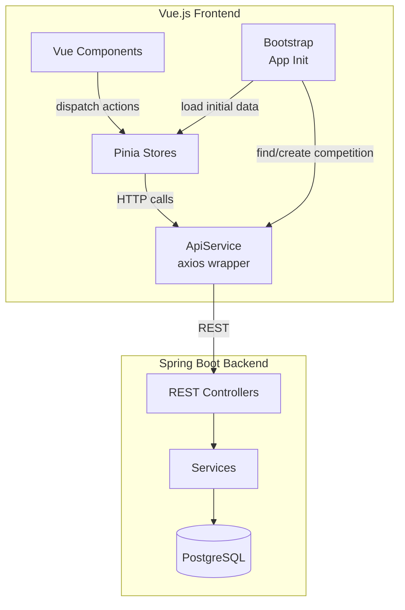
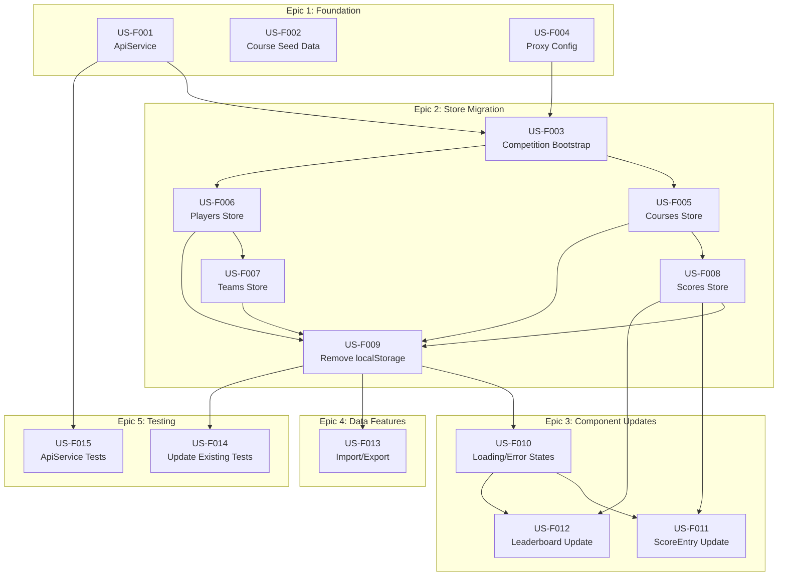

# PRD: Golf Competition App - Frontend API Integration

> **Version:** 1.0
> **Last Updated:** 2026-02-17
> **Status:** Not Started
> **Owner:** Development Team

---

## Implementation Tracking

Progress across working sessions. Use this section to pick up where you left off.

### Story Status Summary

| Story | Title | Status |
|-------|-------|--------|
| US-F001 | Add Axios and Create ApiService | Complete |
| US-F002 | Liquibase Seed Data for Courses | Complete |
| US-F003 | Competition Bootstrap on App Init | Not Started |
| US-F004 | Vue Dev Server Proxy Configuration | Not Started |
| US-F005 | Migrate Courses Store to API | Not Started |
| US-F006 | Migrate Players Store to API | Not Started |
| US-F007 | Migrate Teams Store to API | Not Started |
| US-F008 | Migrate Scores Store to API | Not Started |
| US-F009 | Remove localStorage Persistence, Add API Init Loading | Not Started |
| US-F010 | Add Loading States and Error Handling to Components | Not Started |
| US-F011 | Update ScoreEntry Component for Round-Based Scoring | Not Started |
| US-F012 | Update Leaderboard Components for API Data | Not Started |
| US-F013 | Update Import/Export for API Data | Not Started |
| US-F014 | Update Existing Tests for API-Based Stores | Not Started |
| US-F015 | Add Integration Tests for ApiService | Not Started |

### Next Up

**Recommended next stories:** US-F003 (Competition Bootstrap) and US-F004 (Proxy Config) — these are the remaining foundation stories. US-F004 has no dependencies and can be done immediately. US-F003 depends on US-F001 (complete) and US-F004.

### Progress Log

- **2026-02-17:** US-F001 complete. Created ApiService wrapper with axios for HTTP communication.
- **2026-02-17:** US-F002 complete. Added Liquibase seed migration for 4 golf courses with exact UUIDs matching frontend.

### Files Modified (Cumulative)

- `vue-golfcomp/package.json` — Added axios dependency
- `vue-golfcomp/src/services/ApiService.js` — Created HTTP client wrapper
- `vue-golfcomp/tests/apiService.test.js` — Unit tests for ApiService
- `spring-golfcomp/src/main/resources/db/changelog/changes/007-seed-courses.xml` — Liquibase seed migration
- `spring-golfcomp/src/main/resources/db/changelog/db.changelog-master.xml` — Include new migration
- `spring-golfcomp/src/test/java/com/golfcomp/api/integration/CourseRepositoryTest.java` — Updated test to avoid name conflicts with seeded courses

---

## Table of Contents

0. [Implementation Tracking](#implementation-tracking)
1. [Executive Summary](#1-executive-summary)
2. [Goals and Success Metrics](#2-goals-and-success-metrics)
3. [Technical Foundation](#3-technical-foundation)
4. [Architecture Overview](#4-architecture-overview)
5. [Data Mapping](#5-data-mapping)
6. [Story Dependency Graph](#6-story-dependency-graph)
7. [User Stories](#7-user-stories)
8. [External Dependencies](#8-external-dependencies)
9. [Technical Glossary](#9-technical-glossary)
10. [Future Considerations](#10-future-considerations)

---

## 1. Executive Summary

### 1.1 Problem Statement

The Golf Competition App frontend currently stores all data in `localStorage` via a Pinia persistence plugin. While a Spring Boot REST API backend has been implemented (see `doc/PRD-GolfComp-Backend.md`), the frontend does not yet consume it. This means:

- Data is still at risk of browser cache clearing
- No multi-device or multi-user support
- The backend investment is not yet utilized
- The frontend generates UUIDs client-side and manages all state locally

### 1.2 Proposed Solution

Migrate the Vue.js frontend from localStorage to the Spring Boot REST API by:

- Creating an `ApiService` wrapper (axios-based) for all HTTP communication
- Modifying all Pinia store actions to call API endpoints instead of local mutations
- Removing the localStorage persistence plugin
- Bootstrapping a single default competition on app init
- Mapping the frontend's `courseId`-based scoring to the backend's `roundId`-based scoring
- Keeping money leaderboards, UI state, and per-course breakdowns computed client-side

### 1.3 Scope

**In Scope:**
- Axios dependency and ApiService wrapper
- Liquibase seed data for the 4 courses (backend change)
- Competition bootstrap (find-or-create on app init)
- Vue dev server proxy to backend (port 8081)
- Migration of all 4 data stores (courses, players, teams, scores) to API
- Removal of localStorage persistence plugin
- Component updates for loading states, error handling, round-based scoring
- Import/export updates to work with API
- Test updates for API-based stores

**Out of Scope:**
- Backend snake draft implementation (US-029 — separate backend story)
- Backend CORS configuration (US-031 — separate backend story)
- User authentication/authorization
- Real-time updates (WebSockets)
- Multi-competition UI (single auto-created competition)

### 1.4 Monorepo Context

| Folder | Purpose |
|--------|---------|
| `vue-golfcomp/` | **Primary target** — all frontend changes in this PRD |
| `spring-golfcomp/` | Backend — only US-F002 (Liquibase seed) touches this |

---

## 2. Goals and Success Metrics

| Goal | Metric | Target |
|------|--------|--------|
| API Integration | All CRUD operations use REST API | 100% |
| Data Persistence | Data survives browser refresh/cache clear | 100% |
| No Regressions | All existing functionality preserved | 100% |
| Test Coverage | Frontend tests pass with mocked API | 100% |
| User Experience | Loading states shown during API calls | All async operations |
| Error Handling | API errors displayed via notifications | All error scenarios |

---

## 3. Technical Foundation

### 3.1 Current Frontend Stack

| Layer | Technology | Version |
|-------|-----------|---------|
| Framework | Vue.js | 3.5.24 |
| State Management | Pinia | 3.0.4 |
| Router | Vue Router | 4.6.3 |
| Build Tool | Webpack 5 via Vue CLI | 5.0.8 |
| Testing | Jest + Vue Test Utils | 29.7.0 / 2.4.6 |

### 3.2 New Dependencies

| Package | Version | Purpose |
|---------|---------|---------|
| axios | ^1.7.x | HTTP client for API calls |

### 3.3 Backend API (Already Built)

| Aspect | Detail |
|--------|--------|
| Framework | Spring Boot 3.5.x |
| Port (dev) | 8081 |
| Base URL | `/api/v1` |
| Response Format | `ApiResponse<T>` with `{success, data, error, meta}` |
| Authentication | None (v1) |

### 3.4 Commands

```bash
# From vue-golfcomp/
npm install                    # Install dependencies (including new axios)
npm run serve                  # Dev server :8080 (with proxy to :8081)
npm run build                  # Production build
npm run lint                   # ESLint check
npm test                       # Run all tests

# From repository root
./gradlew frontendInstall      # Install npm deps
./gradlew frontendDev          # Dev server
./gradlew build                # Build all
./gradlew test                 # Test all
./gradlew ci                   # Full CI pipeline
```

---

## 4. Architecture Overview

### 4.1 Before (Current)

```
User Action → Component → Pinia Store Action → Local State Mutation
  → Persistence Plugin → localStorage → Getter → Component Re-render
```

### 4.2 After (Target)

```
User Action → Component → Pinia Store Action → ApiService.method()
  → HTTP Request → Spring Boot API → PostgreSQL
  → HTTP Response → Store State Update → Getter → Component Re-render
```

### 4.3 Component Diagram



### 4.4 Key Architecture Decisions

1. **Single Competition**: On first load, auto-create one competition via API. Store its ID in ApiService. No competition selector UI.

2. **Round-to-Course Mapping**: The backend uses `roundId` for scores, but the frontend UI organizes by course. Each round has exactly one course. On init, fetch all rounds and build a `courseId → roundId` lookup map stored in the courses store.

3. **Client-Side Computed Data**: Money leaderboards (`playerMoneyLeaderboard`, `teamMoneyLeaderboard`), per-course score breakdowns (`courseScoresByTeam`), and per-course columns in leaderboard tables remain computed client-side from fetched data. The backend leaderboard endpoint provides total scores and rankings but lacks per-course breakdowns.

4. **UI Store Unchanged**: The `ui` store (activeSection, sidebar, notifications, loading) remains purely client-side with no API involvement.

5. **ApiService Pattern**: A single `ApiService` class wraps axios, handles ApiResponse unwrapping, error handling, and competition ID injection. All stores call ApiService methods rather than axios directly.

---

## 5. Data Mapping

### 5.1 Frontend-to-Backend Field Mapping

#### Player

| Frontend Field | Backend Request Field | Backend Response Field | Notes |
|---------------|----------------------|----------------------|-------|
| `id` | _(server-generated)_ | `id` | UUID assigned by backend |
| `name` | `name` | `name` | |
| `talentRating` | `talentRating` | `talentRating` | String `"A"`/`"B"`/`"C"`/`"D"` maps to enum |
| `entryFee` | `entryFee` | `entryFee` | Frontend number → Backend BigDecimal |
| `winnings` | `winnings` | `winnings` | Frontend number → Backend BigDecimal |
| `teamId` | _(via assign endpoint)_ | `teamId` | |
| _(none)_ | _(none)_ | `teamName` | New: backend joins team name |
| _(none)_ | _(none)_ | `competitionId` | New: competition context |
| `createdAt` | _(auto)_ | `createdAt` | |
| `updatedAt` | _(auto)_ | `updatedAt` | |

#### Team

| Frontend Field | Backend Request Field | Backend Response Field | Notes |
|---------------|----------------------|----------------------|-------|
| `id` | _(server-generated)_ | `id` | |
| `name` | `name` | `name` | |
| `logoUrl` | `logoUrl` | `logoUrl` | |
| _(none)_ | _(none)_ | `competitionId` | New |

#### Score

| Frontend Field | Backend Request Field | Backend Response Field | Notes |
|---------------|----------------------|----------------------|-------|
| `id` | _(server-generated)_ | `id` | |
| `playerId` | `playerId` | `playerId` | |
| `courseId` | _(mapped to roundId in URL)_ | _(mapped from roundId)_ | **Critical mapping** |
| `value` | `value` | `value` | |
| `timestamp` | _(auto)_ | `createdAt`/`updatedAt` | Field name change |
| _(none)_ | _(none)_ | `roundId` | New |
| _(none)_ | _(none)_ | `playerName` | New |

#### Course/Round Mapping

| Frontend Course | Backend Course (seeded) | Backend Round (auto-created) |
|----------------|----------------------|--------------|
| `{id: '071aaf93-...', name: 'Parkland', order: 1}` | `{id: '071aaf93-...', name: 'Parkland'}` | `{id: <generated>, course: {...}, roundNumber: 1}` |
| `{id: '2b81e674-...', name: 'Heathland', order: 2}` | `{id: '2b81e674-...', name: 'Heathland'}` | `{id: <generated>, course: {...}, roundNumber: 2}` |
| `{id: '38a5c806-...', name: 'Heritage Club', order: 3}` | `{id: '38a5c806-...', name: 'Heritage Club'}` | `{id: <generated>, course: {...}, roundNumber: 3}` |
| `{id: 'd3d8aa11-...', name: 'Moorland', order: 4}` | `{id: 'd3d8aa11-...', name: 'Moorland'}` | `{id: <generated>, course: {...}, roundNumber: 4}` |

### 5.2 Frontend Action-to-API Mapping

| Pinia Store Action | HTTP Method | API Endpoint | Request Body |
|-------------------|------------|-------------|-------------|
| `players/addPlayer` | POST | `/api/v1/competitions/{compId}/players` | `CreatePlayerRequest` |
| `players/updatePlayer` | PUT | `/api/v1/competitions/{compId}/players/{id}` | `UpdatePlayerRequest` |
| `players/deletePlayer` | DELETE | `/api/v1/competitions/{compId}/players/{id}` | _(none)_ |
| `players/assignPlayerToTeam` | PUT | `/api/v1/competitions/{compId}/players/{id}/assign` | `AssignPlayerRequest` |
| `players/unassignPlayerFromTeam` | PUT | `/api/v1/competitions/{compId}/players/{id}/unassign` | _(none)_ |
| `teams/addTeam` | POST | `/api/v1/competitions/{compId}/teams` | `CreateTeamRequest` |
| `teams/updateTeam` | PUT | `/api/v1/competitions/{compId}/teams/{id}` | `UpdateTeamRequest` |
| `teams/deleteTeam` | DELETE | `/api/v1/competitions/{compId}/teams/{id}` | _(none)_ |
| `teams/deleteAllTeams` | DELETE | `/api/v1/competitions/{compId}/teams` | _(none)_ |
| `teams/generateTeams` | POST | `/api/v1/competitions/{compId}/teams/generate` | `GenerateTeamsRequest` |
| `scores/updateScore` | PUT | `/api/v1/competitions/{compId}/rounds/{roundId}/scores` | `UpsertScoreRequest` |
| `scores/deleteAllScores` | DELETE | `/api/v1/competitions/{compId}/scores` | _(none)_ |
| Getter: `playerLeaderboard` | _(client-side)_ | _(computed from fetched data)_ | _(none)_ |
| Getter: `teamLeaderboard` | _(client-side)_ | _(computed from fetched data)_ | _(none)_ |

---

## 6. Story Dependency Graph



**Legend:**
- ⬜ White: Not Started
- Arrows show "must be completed before" relationships
- US-F001, US-F002, US-F004 can be done in parallel (no dependencies)

---

## 7. User Stories

> **Path convention:** All file paths in user stories below are relative to `vue-golfcomp/` unless prefixed with `spring-golfcomp/`. When implementing, work within the appropriate subfolder.

---

### US-F001: Add Axios and Create ApiService

| Attribute | Value |
|-----------|-------|
| **Status** | `Complete` |
| **Type** | `Frontend` |
| **Estimated Effort** | ~2 hours |
| **Epic** | Foundation |
| **Priority** | P0 (Critical) |

#### Description

As a developer, I want an HTTP client service that wraps axios so that all API calls go through a single, consistent layer with error handling, response unwrapping, and base URL configuration.

#### Prerequisites

| Story ID | Title | Status |
|----------|-------|--------|
| — | No prerequisites | — |

#### Acceptance Criteria

- [ ] AC1: `axios` is added as a production dependency in `package.json`
- [ ] AC2: `ApiService` class is created at `src/services/ApiService.js`
- [ ] AC3: ApiService configures axios with base URL `/api/v1` (relative, to work with dev proxy)
- [ ] AC4: ApiService automatically unwraps `ApiResponse.data` on success responses
- [ ] AC5: ApiService throws structured errors on API failures (extracts `error.code` and `error.message` from `ApiResponse`)
- [ ] AC6: ApiService exposes convenience methods: `get(url)`, `post(url, data)`, `put(url, data)`, `delete(url)`
- [ ] AC7: ApiService stores and provides access to the current `competitionId` (set during bootstrap)
- [ ] AC8: ApiService provides helper methods that inject `competitionId` into URLs: `playersUrl(id)`, `teamsUrl(id)`, `roundsUrl(id)`, `scoresUrl(roundId)`, `leaderboardsUrl(type)`
- [ ] AC9: Request/response interceptors log errors to console in development mode
- [ ] AC10: 204 No Content responses (from DELETE endpoints) are handled correctly (no body to unwrap)

#### Agent Instructions

**Objective:**
Create the foundational HTTP service that all stores will use.

**Files to Create/Modify:**

| Action | File Path | Purpose |
|--------|-----------|---------|
| MODIFY | `package.json` | Add `axios` dependency |
| CREATE | `src/services/ApiService.js` | HTTP client wrapper |

**Implementation Details:**

```javascript
// src/services/ApiService.js — Skeleton
import axios from 'axios';

class ApiService {
  constructor() {
    this.client = axios.create({
      baseURL: '/api/v1',
      headers: { 'Content-Type': 'application/json' },
      timeout: 10000
    });
    this._competitionId = null;

    // Response interceptor: unwrap ApiResponse
    this.client.interceptors.response.use(
      (response) => {
        // 204 No Content — no body to unwrap
        if (response.status === 204) return null;
        // Backend returns ApiResponse { success, data, error, meta }
        const apiResponse = response.data;
        if (apiResponse && apiResponse.success !== undefined) {
          return apiResponse.data;
        }
        return response.data;
      },
      (error) => {
        // Extract structured error from ApiResponse if available
        if (error.response?.data?.error) {
          const apiError = error.response.data.error;
          const err = new Error(apiError.message || 'API Error');
          err.code = apiError.code;
          err.status = error.response.status;
          throw err;
        }
        throw error;
      }
    );
  }

  get competitionId() { return this._competitionId; }
  set competitionId(id) { this._competitionId = id; }

  // Base competition URL
  get compUrl() { return `/competitions/${this._competitionId}`; }

  // URL helpers
  playersUrl(id) { return `${this.compUrl}/players${id ? '/' + id : ''}`; }
  teamsUrl(id) { return `${this.compUrl}/teams${id ? '/' + id : ''}`; }
  roundsUrl(id) { return `${this.compUrl}/rounds${id ? '/' + id : ''}`; }
  scoresUrl(roundId) { return `${this.compUrl}/rounds/${roundId}/scores`; }
  leaderboardsUrl(type) { return `${this.compUrl}/leaderboards/${type}`; }

  // HTTP methods
  async get(url) { return this.client.get(url); }
  async post(url, data) { return this.client.post(url, data); }
  async put(url, data) { return this.client.put(url, data); }
  async delete(url) { return this.client.delete(url); }
}

export default new ApiService();
```

**Constraints:**
- DO NOT make any API calls in this story — only set up the service
- Export as a singleton instance (like `NotificationService`)

**Expected Output:**
- `npm install` succeeds with new axios dependency
- `npm run lint` passes
- `npm run build` succeeds

#### Testing Requirements

| Test Type | Location |
|-----------|----------|
| Unit | `tests/apiService.test.js` |

Create a basic test that:
- Imports ApiService
- Verifies it has the expected methods (`get`, `post`, `put`, `delete`)
- Verifies URL helpers generate correct paths when competitionId is set
- Mocks axios to verify response unwrapping and error extraction

#### Definition of Done

- [ ] All acceptance criteria met
- [ ] All tests written and passing
- [ ] `npm run lint` passes
- [ ] `npm run build` succeeds

---

### US-F002: Liquibase Seed Data for 4 Courses

| Attribute | Value |
|-----------|-------|
| **Status** | `Complete` |
| **Type** | `Backend` |
| **Estimated Effort** | ~30 minutes |
| **Epic** | Foundation |
| **Priority** | P0 (Critical) |

#### Description

As a developer, I want the 4 golf courses pre-seeded in the database via Liquibase migration so that when the frontend creates a competition and rounds, the courses already exist with the same UUIDs used in the frontend.

#### Prerequisites

| Story ID | Title | Status |
|----------|-------|--------|
| US-004 (Backend PRD) | Course Entity | Complete |

#### Acceptance Criteria

- [x] AC1: Liquibase migration `007-seed-courses.xml` inserts 4 courses
- [x] AC2: Course IDs match the frontend hardcoded UUIDs exactly:
  - `071aaf93-773e-49d0-935e-4b825e25670f` — Parkland
  - `2b81e674-816a-42ea-b524-54a96bfb2b14` — Heathland
  - `38a5c806-7f44-4ebb-9472-6ec79431c5ff` — Heritage Club
  - `d3d8aa11-5320-477b-9602-6501dd63b186` — Moorland
- [x] AC3: Migration is idempotent (uses `preconditions` or `onFail="MARK_RAN"` to skip if courses exist)
- [x] AC4: Master changelog includes the new migration file
- [x] AC5: `./gradlew backendTest` passes (H2 compatible)

#### Agent Instructions

**Objective:**
Create a Liquibase seed migration that inserts the 4 courses with specific UUIDs.

**Files to Create/Modify:**

| Action | File Path | Purpose |
|--------|-----------|---------|
| CREATE | `spring-golfcomp/src/main/resources/db/changelog/changes/007-seed-courses.xml` | Seed data migration |
| MODIFY | `spring-golfcomp/src/main/resources/db/changelog/db.changelog-master.xml` | Include new migration |

**Implementation Details:**

The migration should use `<insert>` changesets with preconditions that check if rows already exist. Each course needs:
- `id`: The exact UUID from the frontend `courses.js` store
- `name`: Course name (Parkland, Heathland, Heritage Club, Moorland)
- `facility`: NULL
- `location`: NULL
- `created_at` / `updated_at`: `NOW()`

**Reference:** See `vue-golfcomp/src/stores/courses.js` lines 6-9 for exact UUIDs and names.

**Constraints:**
- Must work with both PostgreSQL (dev/prod) and H2 (test)
- Use `runOnChange="false"` since this is seed data, not schema

#### Testing Requirements

| Test Type | Location |
|-----------|----------|
| Integration | Existing backend tests should still pass |

Run: `./gradlew backendTest`

#### Definition of Done

- [ ] All acceptance criteria met
- [ ] `./gradlew backendBuild` succeeds
- [ ] `./gradlew backendTest` passes
- [ ] Courses appear in database when backend starts

---

### US-F003: Competition Bootstrap on App Init

| Attribute | Value |
|-----------|-------|
| **Status** | `Not Started` |
| **Type** | `Frontend` |
| **Estimated Effort** | ~2 hours |
| **Epic** | Foundation |
| **Priority** | P0 (Critical) |

#### Description

As a user, I want the app to automatically find or create a default competition on startup so that I do not need to manually manage competitions and all data is scoped to a single competition context.

#### Prerequisites

| Story ID | Title | Status |
|----------|-------|--------|
| US-F001 | ApiService | Required |
| US-F004 | Proxy Config | Required |

#### Acceptance Criteria

- [ ] AC1: On app init, call `GET /api/v1/competitions` to check for existing competitions
- [ ] AC2: If a competition exists, use its ID as the active competition
- [ ] AC3: If no competition exists, create one via `POST /api/v1/competitions` with default values (name: `"Golf Competition"`, dates: today to today+7, location: null)
- [ ] AC4: After obtaining competition ID, create 4 rounds (one per course) via `POST /api/v1/competitions/{compId}/rounds` if they do not exist. Use round numbers 1-4 matching course order and `playDate` = today.
- [ ] AC5: Store the `competitionId` in `ApiService.competitionId`
- [ ] AC6: Bootstrap runs before any store data loading
- [ ] AC7: If bootstrap fails (backend not available), show an error notification and prevent app from loading into a broken state
- [ ] AC8: Create a `bootstrap.js` module that exports an `initializeApp()` async function

#### Agent Instructions

**Objective:**
Create the bootstrap logic that ensures a competition and its rounds exist before the app loads data.

**Files to Create/Modify:**

| Action | File Path | Purpose |
|--------|-----------|---------|
| CREATE | `src/services/bootstrap.js` | App initialization logic |
| MODIFY | `src/main.js` | Call bootstrap before mounting app |

**Implementation Details:**

```javascript
// src/services/bootstrap.js — Skeleton
import ApiService from './ApiService';

const COURSE_IDS = [
  '071aaf93-773e-49d0-935e-4b825e25670f', // Parkland
  '2b81e674-816a-42ea-b524-54a96bfb2b14', // Heathland
  '38a5c806-7f44-4ebb-9472-6ec79431c5ff', // Heritage Club
  'd3d8aa11-5320-477b-9602-6501dd63b186'  // Moorland
];

export async function initializeApp() {
  // 1. Find or create competition
  const competitions = await ApiService.get('/competitions');

  let competitionId;
  if (competitions && competitions.length > 0) {
    competitionId = competitions[0].id;
  } else {
    const today = new Date().toISOString().split('T')[0];
    const endDate = new Date(Date.now() + 7 * 86400000).toISOString().split('T')[0];
    const newComp = await ApiService.post('/competitions', {
      name: 'Golf Competition',
      startDate: today,
      endDate: endDate,
      location: null
    });
    competitionId = newComp.id;
  }

  ApiService.competitionId = competitionId;

  // 2. Ensure rounds exist (one per course)
  const rounds = await ApiService.get(ApiService.roundsUrl());
  if (!rounds || rounds.length === 0) {
    const today = new Date().toISOString().split('T')[0];
    for (let i = 0; i < COURSE_IDS.length; i++) {
      await ApiService.post(ApiService.roundsUrl(), {
        courseId: COURSE_IDS[i],
        playDate: today,
        roundNumber: i + 1
      });
    }
  }
}
```

**Modify `main.js`** to call bootstrap before mount:

```javascript
initializeApp()
  .then(() => app.mount('#app'))
  .catch((error) => {
    console.error('Failed to initialize app:', error);
    app.mount('#app'); // Mount anyway but show error state
  });
```

**Constraints:**
- Do NOT remove the persistence plugin yet (that is US-F009)
- The bootstrap must be idempotent — safe to run multiple times
- Course IDs must match `vue-golfcomp/src/stores/courses.js` exactly

#### Testing Requirements

| Test Type | Location |
|-----------|----------|
| Unit | `tests/bootstrap.test.js` |

Test scenarios:
- When competitions exist, uses first competition ID
- When no competitions exist, creates one and uses its ID
- When rounds exist, does not create new ones
- When no rounds exist, creates 4 rounds
- When API is unavailable, throws/rejects

#### Definition of Done

- [ ] All acceptance criteria met
- [ ] All tests written and passing
- [ ] `npm run lint` passes
- [ ] App starts correctly with running backend
- [ ] App shows error state when backend is unavailable

---

### US-F004: Vue Dev Server Proxy Configuration

| Attribute | Value |
|-----------|-------|
| **Status** | `Not Started` |
| **Type** | `Frontend` |
| **Estimated Effort** | ~15 minutes |
| **Epic** | Foundation |
| **Priority** | P0 (Critical) |

#### Description

As a developer, I want the Vue dev server to proxy API requests to the Spring Boot backend so that I can develop the frontend on port 8080 while the backend runs on port 8081 without CORS issues.

#### Prerequisites

| Story ID | Title | Status |
|----------|-------|--------|
| — | No prerequisites | — |

#### Acceptance Criteria

- [ ] AC1: `vue.config.js` configures a proxy for `/api/**` requests to `http://localhost:8081`
- [ ] AC2: Dev server on port 8080 successfully proxies API calls to backend on port 8081
- [ ] AC3: WebSocket upgrade is enabled in proxy config (for future use)
- [ ] AC4: Proxy does NOT affect static asset serving

#### Agent Instructions

**Objective:**
Add dev server proxy configuration to forward API requests to the backend.

**Files to Create/Modify:**

| Action | File Path | Purpose |
|--------|-----------|---------|
| MODIFY | `vue.config.js` | Add proxy configuration |

**Implementation Details:**

Add to the existing `devServer` section in `vue.config.js`:

```javascript
devServer: {
  port: 8080,
  open: true,
  historyApiFallback: true,
  proxy: {
    '/api': {
      target: 'http://localhost:8081',
      changeOrigin: true,
      ws: true,
      logLevel: 'debug'
    }
  }
}
```

**Constraints:**
- Do NOT change the existing port (8080)
- Do NOT remove existing `historyApiFallback` setting
- The backend dev profile (`application-dev.yml`) already runs on port 8081

#### Testing Requirements

Manual verification:
1. Start backend: `./gradlew bootRun` (runs on 8081)
2. Start frontend: `cd vue-golfcomp && npm run serve` (runs on 8080)
3. Open browser to `http://localhost:8080/api/v1/competitions` — should proxy to backend

#### Definition of Done

- [ ] All acceptance criteria met
- [ ] `npm run lint` passes
- [ ] `npm run build` succeeds
- [ ] Proxy works when both servers are running

---

### US-F005: Migrate Courses Store to Fetch from API

| Attribute | Value |
|-----------|-------|
| **Status** | `Not Started` |
| **Type** | `Frontend` |
| **Estimated Effort** | ~2 hours |
| **Epic** | Store Migration |
| **Priority** | P0 (Critical) |

#### Description

As a developer, I want the courses store to fetch course and round data from the API so that courses are backed by the database and the round-to-course mapping is available for score operations.

#### Prerequisites

| Story ID | Title | Status |
|----------|-------|--------|
| US-F001 | ApiService | Required |
| US-F003 | Competition Bootstrap | Required |

#### Acceptance Criteria

- [ ] AC1: Courses store has a `fetchCourses()` action that calls `GET /api/v1/competitions/{compId}/rounds`
- [ ] AC2: Store state includes `rounds` array (raw API data) in addition to `courses` array
- [ ] AC3: Each course object in the store includes `id`, `name`, `order` (from roundNumber), and a `roundId` field
- [ ] AC4: Store provides a `roundIdByCourseId(courseId)` getter for score operations
- [ ] AC5: Store provides a `courseIdByRoundId(roundId)` getter for reverse lookups
- [ ] AC6: Hardcoded courses array is kept as fallback only if API fetch fails
- [ ] AC7: All existing getters (`allCourses`, `courseById`, `courseByName`, `coursesSorted`) continue to work

#### Agent Instructions

**Objective:**
Transform the static courses store into one that fetches round data from the API and builds a courseId-to-roundId mapping.

**Files to Create/Modify:**

| Action | File Path | Purpose |
|--------|-----------|---------|
| MODIFY | `src/stores/courses.js` | Add API fetching, round mapping |

**Implementation Details:**

The backend `RoundResponse` contains a nested `course` object:
```json
{
  "id": "<roundId>",
  "competitionId": "<compId>",
  "course": { "id": "<courseId>", "name": "Parkland", "facility": null, "location": null },
  "playDate": "2026-02-17",
  "roundNumber": 1
}
```

The store should:
1. Fetch rounds from `GET /api/v1/competitions/{compId}/rounds`
2. Extract courses from `round.course` objects
3. Build the `courses` array as: `{ id: round.course.id, name: round.course.name, order: round.roundNumber, roundId: round.id }`
4. Store the raw `rounds` array for reference

```javascript
state: () => ({
  courses: [
    // Hardcoded defaults/fallback — roundId is null until fetched
    { id: '071aaf93-773e-49d0-935e-4b825e25670f', name: 'Parkland', order: 1, roundId: null },
    { id: '2b81e674-816a-42ea-b524-54a96bfb2b14', name: 'Heathland', order: 2, roundId: null },
    { id: '38a5c806-7f44-4ebb-9472-6ec79431c5ff', name: 'Heritage Club', order: 3, roundId: null },
    { id: 'd3d8aa11-5320-477b-9602-6501dd63b186', name: 'Moorland', order: 4, roundId: null }
  ],
  rounds: [],
  loaded: false
}),

getters: {
  // ... existing getters remain unchanged ...
  roundIdByCourseId: (state) => (courseId) => {
    const course = state.courses.find(c => c.id === courseId);
    return course ? course.roundId : null;
  },
  courseIdByRoundId: (state) => (roundId) => {
    const course = state.courses.find(c => c.roundId === roundId);
    return course ? course.id : null;
  }
},

actions: {
  async fetchCourses() {
    const rounds = await ApiService.get(ApiService.roundsUrl());
    this.rounds = rounds;
    this.courses = rounds.map(round => ({
      id: round.course.id,
      name: round.course.name,
      order: round.roundNumber,
      roundId: round.id
    })).sort((a, b) => a.order - b.order);
    this.loaded = true;
  }
}
```

**Constraints:**
- Keep hardcoded course UUIDs as fallback defaults in state initialization
- The `roundId` field on each course is the key mapping field for scores
- Existing components that use `courseById`, `allCourses`, etc. must continue working

#### Testing Requirements

| Test Type | Location |
|-----------|----------|
| Unit | `tests/courses.test.js` |

Test scenarios:
- `fetchCourses` populates courses from API round data
- `roundIdByCourseId` returns correct roundId
- `courseIdByRoundId` returns correct courseId
- Fallback courses are available before `fetchCourses` is called
- All existing getters work with both fallback and API data

#### Definition of Done

- [ ] All acceptance criteria met
- [ ] All tests written and passing
- [ ] `npm run lint` passes
- [ ] Existing components using courses store still work

---

### US-F006: Migrate Players Store to API

| Attribute | Value |
|-----------|-------|
| **Status** | `Not Started` |
| **Type** | `Frontend` |
| **Estimated Effort** | ~3 hours |
| **Epic** | Store Migration |
| **Priority** | P0 (Critical) |

#### Description

As a developer, I want the players store to perform all CRUD and assignment operations via the REST API so that player data is persisted in the database.

#### Prerequisites

| Story ID | Title | Status |
|----------|-------|--------|
| US-F001 | ApiService | Required |
| US-F003 | Competition Bootstrap | Required |

#### Acceptance Criteria

- [ ] AC1: `fetchPlayers()` action calls `GET /api/v1/competitions/{compId}/players` and populates state
- [ ] AC2: `addPlayer()` action calls `POST` and adds returned player to state
- [ ] AC3: `updatePlayer()` action calls `PUT` and updates state
- [ ] AC4: `deletePlayer()` action calls `DELETE` and removes from state
- [ ] AC5: `assignPlayerToTeam()` action calls `PUT .../players/{id}/assign` with `{ teamId }`
- [ ] AC6: `unassignPlayerFromTeam()` action calls `PUT .../players/{id}/unassign`
- [ ] AC7: `unassignAllPlayers()` iterates and calls unassign for each assigned player
- [ ] AC8: All actions are async and propagate errors
- [ ] AC9: `uuid` import is removed (server generates IDs)
- [ ] AC10: All existing getters continue to work with API-sourced data
- [ ] AC11: Player objects in state map backend `BigDecimal` entryFee/winnings to JavaScript numbers

#### Agent Instructions

**Objective:**
Replace all local state mutations with API calls, keeping the same action signatures.

**Files to Create/Modify:**

| Action | File Path | Purpose |
|--------|-----------|---------|
| MODIFY | `src/stores/players.js` | Replace local operations with API calls |

**Implementation Details:**

Each action should:
1. Call the API via ApiService
2. On success, update the local state from the response
3. On error, propagate the error for the component to handle

**Key transformation pattern:**

```javascript
// BEFORE
addPlayer(player) {
  const newPlayer = { id: uuidv4(), ...player, createdAt: new Date().toISOString() };
  this.players.push(newPlayer);
  return newPlayer.id;
}

// AFTER
async addPlayer(player) {
  const created = await ApiService.post(ApiService.playersUrl(), {
    name: player.name,
    talentRating: player.talentRating,
    entryFee: parseFloat(player.entryFee) || 0,
    winnings: parseFloat(player.winnings) || 0
  });
  const mappedPlayer = mapPlayerResponse(created);
  this.players.push(mappedPlayer);
  return mappedPlayer.id;
}
```

**Response mapping function:**
```javascript
function mapPlayerResponse(response) {
  return {
    id: response.id,
    name: response.name,
    talentRating: response.talentRating,
    entryFee: parseFloat(response.entryFee) || 0,
    winnings: parseFloat(response.winnings) || 0,
    teamId: response.teamId || null,
    teamName: response.teamName || null,
    createdAt: response.createdAt,
    updatedAt: response.updatedAt
  };
}
```

**Constraints:**
- Remove `import { v4 as uuidv4 } from 'uuid'` — backend generates IDs
- Remove the score cascade in `deletePlayer` — backend handles cascading or the calling component can handle it
- Keep the same action names and parameter shapes so components do not need updating yet
- `unassignAllPlayers()` does not have a bulk endpoint, so iterate assigned players

**Reference Files:**
- `spring-golfcomp/src/main/java/com/golfcomp/api/dto/request/CreatePlayerRequest.java`
- `spring-golfcomp/src/main/java/com/golfcomp/api/dto/response/PlayerResponse.java`

#### Testing Requirements

| Test Type | Location |
|-----------|----------|
| Unit | `tests/players.test.js` |

Test scenarios:
- `fetchPlayers` populates store from API response
- `addPlayer` calls API and adds returned player to state
- `updatePlayer` calls API and updates state
- `deletePlayer` calls API and removes from state
- `assignPlayerToTeam` calls assign endpoint
- Error handling: API failure does not corrupt state
- Mock ApiService for all tests

#### Definition of Done

- [ ] All acceptance criteria met
- [ ] All tests written and passing
- [ ] `npm run lint` passes
- [ ] Player CRUD works end-to-end with running backend

---

### US-F007: Migrate Teams Store to API

| Attribute | Value |
|-----------|-------|
| **Status** | `Not Started` |
| **Type** | `Frontend` |
| **Estimated Effort** | ~3 hours |
| **Epic** | Store Migration |
| **Priority** | P0 (Critical) |

#### Description

As a developer, I want the teams store to perform all operations via the REST API so that team data is persisted in the database.

#### Prerequisites

| Story ID | Title | Status |
|----------|-------|--------|
| US-F001 | ApiService | Required |
| US-F003 | Competition Bootstrap | Required |
| US-F006 | Players Store Migration | Required (teams actions reference players store) |

#### Acceptance Criteria

- [ ] AC1: `fetchTeams()` action calls `GET /api/v1/competitions/{compId}/teams` and populates state
- [ ] AC2: `addTeam()` action calls `POST` with `{ name, logoUrl }`
- [ ] AC3: `updateTeam()` action calls `PUT`
- [ ] AC4: `deleteTeam()` action calls `DELETE` and re-fetches players (backend handles unassignment)
- [ ] AC5: `deleteAllTeams()` action calls `DELETE /api/v1/competitions/{compId}/teams` and re-fetches players
- [ ] AC6: `generateTeams()` action calls `POST .../teams/generate` with `{ numberOfTeams }` (depends on backend US-029)
- [ ] AC7: `uploadTeamLogo()` updates team logo via `PUT .../teams/{id}` with `{ name, logoUrl }`
- [ ] AC8: All actions are async and propagate errors
- [ ] AC9: `uuid` import is removed
- [ ] AC10: All existing getters continue to work

#### Agent Instructions

**Objective:**
Replace all local team state mutations with API calls.

**Files to Create/Modify:**

| Action | File Path | Purpose |
|--------|-----------|---------|
| MODIFY | `src/stores/teams.js` | Replace local operations with API calls |

**Implementation Details:**

**For `deleteTeam` and `deleteAllTeams`:** After the delete API call, re-fetch players because the backend unassigns them:
```javascript
async deleteTeam(id) {
  await ApiService.delete(ApiService.teamsUrl(id));
  this.teams = this.teams.filter(t => t.id !== id);
  const playersStore = usePlayersStore();
  await playersStore.fetchPlayers();
}
```

**For `generateTeams`:** Calls backend snake draft then refreshes both stores:
```javascript
async generateTeams(numberOfTeams) {
  // NOTE: Depends on backend US-029 (Snake Draft) — will 404 until implemented
  await ApiService.post(ApiService.teamsUrl() + '/generate', { numberOfTeams });
  await this.fetchTeams();
  const playersStore = usePlayersStore();
  await playersStore.fetchPlayers();
}
```

**Response mapping:**
```javascript
function mapTeamResponse(response) {
  return {
    id: response.id,
    name: response.name,
    logoUrl: response.logoUrl || null,
    createdAt: response.createdAt,
    updatedAt: response.updatedAt
  };
}
```

**Constraints:**
- `generateTeams()` depends on backend US-029 which is not yet built. Implement the API call but add a code comment noting the dependency.
- Remove the local `assignPlayersToTeams()` helper method (backend handles this)
- Remove `import { v4 as uuidv4 } from 'uuid'`
- Keep `uploadTeamLogo` working — it uses the update endpoint with the logoUrl field

**Reference Files:**
- `spring-golfcomp/src/main/java/com/golfcomp/api/dto/request/CreateTeamRequest.java`
- `spring-golfcomp/src/main/java/com/golfcomp/api/dto/response/TeamResponse.java`

#### Testing Requirements

| Test Type | Location |
|-----------|----------|
| Unit | `tests/teams.test.js` (update existing `tests/pinia_teams.test.js`) |

Test scenarios:
- `fetchTeams` populates store from API response
- `addTeam` calls API and adds returned team to state
- `deleteTeam` calls API, removes from state, and re-fetches players
- `deleteAllTeams` calls bulk delete and re-fetches players
- `generateTeams` calls generate endpoint and re-fetches both stores
- Error handling

#### Definition of Done

- [ ] All acceptance criteria met
- [ ] All tests written and passing
- [ ] `npm run lint` passes
- [ ] Team CRUD works end-to-end with running backend

---

### US-F008: Migrate Scores Store to API

| Attribute | Value |
|-----------|-------|
| **Status** | `Not Started` |
| **Type** | `Frontend` |
| **Estimated Effort** | ~4 hours |
| **Epic** | Store Migration |
| **Priority** | P0 (Critical) |

#### Description

As a developer, I want the scores store to perform all score operations via the REST API, mapping between the frontend's `courseId`-based model and the backend's `roundId`-based model.

#### Prerequisites

| Story ID | Title | Status |
|----------|-------|--------|
| US-F001 | ApiService | Required |
| US-F003 | Competition Bootstrap | Required |
| US-F005 | Courses Store Migration | Required (for roundId mapping) |

#### Acceptance Criteria

- [ ] AC1: `fetchScores()` action fetches scores for ALL rounds and populates state
- [ ] AC2: `updateScore({ playerId, courseId, value })` maps `courseId` to `roundId` via courses store, then calls `PUT .../rounds/{roundId}/scores` with `{ playerId, value }`
- [ ] AC3: Score objects in state retain `courseId` field (mapped from roundId) for compatibility with existing getters
- [ ] AC4: All existing getters (`scoreByPlayerAndCourse`, `playerTotalScore`, `teamTotalScore`, `playerLeaderboard`, `teamLeaderboard`, `playerMoneyLeaderboard`, `teamMoneyLeaderboard`, `courseScoresByTeam`) continue to work
- [ ] AC5: `uuid` import is removed
- [ ] AC6: All actions are async
- [ ] AC7: `deleteScore` action handles the lack of a single-score-delete endpoint (local state removal with TODO comment)

#### Agent Instructions

**Objective:**
Replace score operations with API calls while maintaining the courseId-based interface that components expect.

**Files to Create/Modify:**

| Action | File Path | Purpose |
|--------|-----------|---------|
| MODIFY | `src/stores/scores.js` | Replace local operations with API calls |

**Implementation Details:**

**Score fetching** — the backend provides scores per round, so iterate all rounds:
```javascript
async fetchScores() {
  const coursesStore = useCoursesStore();
  const allScores = [];

  for (const course of coursesStore.allCourses) {
    if (!course.roundId) continue;
    const roundScores = await ApiService.get(ApiService.scoresUrl(course.roundId));
    const mappedScores = roundScores.map(score => ({
      id: score.id,
      playerId: score.playerId,
      courseId: course.id,        // Map roundId back to courseId for getter compatibility
      value: score.value,
      timestamp: score.updatedAt || score.createdAt
    }));
    allScores.push(...mappedScores);
  }

  this.scores = allScores;
}
```

**Score upsert:**
```javascript
async updateScore({ playerId, courseId, value }) {
  const coursesStore = useCoursesStore();
  const roundId = coursesStore.roundIdByCourseId(courseId);
  if (!roundId) throw new Error(`No round found for course ${courseId}`);

  const scoreValue = parseInt(value);
  if (isNaN(scoreValue)) throw new Error('Score must be a valid number');

  const result = await ApiService.put(ApiService.scoresUrl(roundId), {
    playerId,
    value: scoreValue
  });

  // Update local state
  const existingIndex = this.scores.findIndex(
    s => s.playerId === playerId && s.courseId === courseId
  );
  const mappedScore = {
    id: result.id,
    playerId: result.playerId,
    courseId: courseId,
    value: result.value,
    timestamp: result.updatedAt || result.createdAt
  };

  if (existingIndex !== -1) {
    this.scores[existingIndex] = mappedScore;
  } else {
    this.scores.push(mappedScore);
  }
}
```

**Delete score:** Backend has no single-score-delete endpoint. Keep `deleteScore` as local state removal:
```javascript
deleteScore(id) {
  // TODO: Backend needs DELETE /api/v1/.../scores/{id} endpoint
  // For now, remove from local state only. Score will reappear on next fetchScores()
  this.scores = this.scores.filter(score => score.id !== id);
}
```

**Constraints:**
- Maintain `courseId` in score objects for backward compatibility with all getters
- Keep all existing computed getters — they compute from local state populated from API
- Remove `import { v4 as uuidv4 } from 'uuid'`
- The `scoreByPlayerAndCourse` getter is called inconsistently: as `(playerId, courseId)` from DataService and as `({ playerId, courseId })` from ScoreEntry. Normalize to handle the two-argument form only.

**Reference Files:**
- `spring-golfcomp/src/main/java/com/golfcomp/api/dto/request/UpsertScoreRequest.java`
- `spring-golfcomp/src/main/java/com/golfcomp/api/dto/response/ScoreResponse.java`

#### Testing Requirements

| Test Type | Location |
|-----------|----------|
| Unit | `tests/scores.test.js` (update existing) |

Test scenarios:
- `fetchScores` fetches from all rounds and maps to courseId
- `updateScore` maps courseId to roundId and calls correct endpoint
- `updateScore` updates local state after API success
- Money leaderboard getters still compute correctly from local state
- Mock ApiService and courses store for all tests

#### Definition of Done

- [ ] All acceptance criteria met
- [ ] All tests written and passing
- [ ] `npm run lint` passes
- [ ] Score entry works end-to-end with running backend

---

### US-F009: Remove localStorage Persistence, Add API-Based Data Loading

| Attribute | Value |
|-----------|-------|
| **Status** | `Not Started` |
| **Type** | `Frontend` |
| **Estimated Effort** | ~2 hours |
| **Epic** | Store Migration |
| **Priority** | P0 (Critical) |

#### Description

As a developer, I want to remove the localStorage persistence plugin and replace it with API-based data loading on app init so that the app uses the database as its single source of truth.

#### Prerequisites

| Story ID | Title | Status |
|----------|-------|--------|
| US-F005 | Courses Store Migration | Required |
| US-F006 | Players Store Migration | Required |
| US-F007 | Teams Store Migration | Required |
| US-F008 | Scores Store Migration | Required |

#### Acceptance Criteria

- [ ] AC1: `persistence.js` is deleted
- [ ] AC2: `main.js` no longer imports or uses `persistencePlugin`
- [ ] AC3: App loads all data from API on init (after bootstrap): courses, players, teams, scores — in that order
- [ ] AC4: Data loading is added to `bootstrap.js` (or a separate function called after bootstrap)
- [ ] AC5: A global loading spinner is shown while data loads
- [ ] AC6: If any data load fails, an error notification is shown but app still renders
- [ ] AC7: `localStorage.removeItem('golf-competition-app')` is NOT called automatically (user's old data is left alone, just ignored)
- [ ] AC8: The `uuid` package can be removed from `package.json` if no other code uses it

#### Agent Instructions

**Objective:**
Remove the localStorage persistence and add API-based data loading.

**Files to Create/Modify:**

| Action | File Path | Purpose |
|--------|-----------|---------|
| DELETE | `src/stores/persistence.js` | Remove localStorage persistence |
| MODIFY | `src/main.js` | Remove persistence plugin import/usage |
| MODIFY | `src/services/bootstrap.js` | Add data loading after competition bootstrap |

**Implementation Details:**

Update `bootstrap.js` to load all data after competition setup:

```javascript
export async function initializeApp() {
  // 1. Competition bootstrap (from US-F003)
  await bootstrapCompetition();

  // 2. Load all data from API in dependency order
  const coursesStore = useCoursesStore();
  const playersStore = usePlayersStore();
  const teamsStore = useTeamsStore();
  const scoresStore = useScoresStore();

  await coursesStore.fetchCourses();         // Must be first (scores need roundId mapping)

  await Promise.all([                        // These can be parallel
    playersStore.fetchPlayers(),
    teamsStore.fetchTeams()
  ]);

  await scoresStore.fetchScores();           // After courses (needs roundId mapping)
}
```

Update `main.js`:
```javascript
const pinia = createPinia();
// NO MORE: pinia.use(persistencePlugin);
app.use(pinia);
```

**Constraints:**
- Do NOT delete the user's localStorage data — just stop reading/writing it
- Check if `uuid` is used anywhere else before removing from `package.json` (grep for `uuidv4` or `uuid`)
- The loading order matters: courses must load first because scores need the `roundIdByCourseId` mapping

#### Testing Requirements

| Test Type | Location |
|-----------|----------|
| Unit | `tests/bootstrap.test.js` (update) |

Test scenarios:
- `initializeApp` calls bootstrap then loads all data
- Data loads in correct order (courses first)
- Failures in individual store loads do not prevent other stores from loading

#### Definition of Done

- [ ] All acceptance criteria met
- [ ] All tests written and passing
- [ ] `npm run lint` passes
- [ ] `npm run build` succeeds
- [ ] App loads data from API on startup
- [ ] No references to persistence plugin remain

---

### US-F010: Add Loading States and Error Handling to Components

| Attribute | Value |
|-----------|-------|
| **Status** | `Not Started` |
| **Type** | `Frontend` |
| **Estimated Effort** | ~3 hours |
| **Epic** | Component Updates |
| **Priority** | P1 (High) |

#### Description

As a user, I want to see loading indicators when data is being saved or fetched, and clear error messages when something goes wrong, so that I know the app is working and can recover from errors.

#### Prerequisites

| Story ID | Title | Status |
|----------|-------|--------|
| US-F009 | Remove localStorage, Add API Init Loading | Required |

#### Acceptance Criteria

- [ ] AC1: All components that call store actions show a loading state during API calls
- [ ] AC2: All components that call store actions catch errors and show notification via NotificationService
- [ ] AC3: The `ui` store's `isLoading` flag is set during initial data load
- [ ] AC4: A global loading overlay or spinner is shown during app initialization
- [ ] AC5: Form submit buttons are disabled while API calls are in progress
- [ ] AC6: Delete confirmations work correctly with async operations
- [ ] AC7: Network errors show user-friendly messages (not raw axios errors)

#### Agent Instructions

**Objective:**
Add proper loading and error UX to all components that interact with stores.

**Files to Create/Modify:**

| Action | File Path | Purpose |
|--------|-----------|---------|
| MODIFY | `src/App.vue` | Add global loading overlay |
| MODIFY | `src/components/admin/PlayerList.vue` | Add loading/error handling |
| MODIFY | `src/components/admin/PlayerForm.vue` | Add loading/error handling |
| MODIFY | `src/components/admin/TeamList.vue` | Add loading/error handling |
| MODIFY | `src/components/admin/TeamForm.vue` | Add loading/error handling |
| MODIFY | `src/components/admin/PlayerAssignment.vue` | Add loading/error handling |
| MODIFY | `src/services/bootstrap.js` | Set ui.isLoading during init |

**Implementation Pattern:**

For each component action:
```javascript
const isSubmitting = ref(false);

async function handleAction() {
  isSubmitting.value = true;
  try {
    await store.someAction(data);
    NotificationService.success('Action completed');
  } catch (error) {
    NotificationService.error(error.message || 'An error occurred');
  } finally {
    isSubmitting.value = false;
  }
}
```

For the global loading overlay in `App.vue`:
```vue
<div v-if="uiStore.isLoading" class="global-loading-overlay">
  <div class="spinner"></div>
  <p>Loading...</p>
</div>
```

**Constraints:**
- Use the existing `NotificationService` for error display
- Use the existing `ui` store's `isLoading` state
- Do NOT change component layouts or styling beyond adding loading indicators
- Error messages should be user-friendly, not technical

#### Testing Requirements

Visual verification:
- Loading spinner shows during app init
- Buttons disable during save operations
- Error notifications appear on API failures

#### Definition of Done

- [ ] All acceptance criteria met
- [ ] `npm run lint` passes
- [ ] `npm run build` succeeds
- [ ] Visual verification of loading states
- [ ] Error handling works when backend is stopped

---

### US-F011: Update ScoreEntry Component for Round-Based Scoring

| Attribute | Value |
|-----------|-------|
| **Status** | `Not Started` |
| **Type** | `Frontend` |
| **Estimated Effort** | ~2 hours |
| **Epic** | Component Updates |
| **Priority** | P1 (High) |

#### Description

As a user, I want to enter scores on the scoring page and have them saved to the backend, with the course-to-round mapping handled transparently.

#### Prerequisites

| Story ID | Title | Status |
|----------|-------|--------|
| US-F008 | Scores Store Migration | Required |
| US-F010 | Loading States | Required |

#### Acceptance Criteria

- [ ] AC1: ScoreEntry component works with the migrated async scores store
- [ ] AC2: Saving a score shows a loading state on the Save button
- [ ] AC3: Score save errors are displayed via notification
- [ ] AC4: The "Clear" button removes the score locally (with a comment noting the backend limitation)
- [ ] AC5: Score values from the API populate the input fields correctly on page load
- [ ] AC6: The component's calls to `scoreByPlayerAndCourse` use a consistent pattern

#### Agent Instructions

**Objective:**
Ensure ScoreEntry works correctly with the async API-backed scores store.

**Files to Create/Modify:**

| Action | File Path | Purpose |
|--------|-----------|---------|
| MODIFY | `src/components/scoring/ScoreEntry.vue` | Async save/load, loading states |

**Implementation Details:**

The ScoreEntry component already has `isSaving` state and try/catch in `saveScore`. The main changes:
1. `saveScore` now calls an async store action (add `await`)
2. `loadScores` works with the store's already-fetched data (no change needed if store is pre-loaded)
3. `clearScore` needs updating since backend has no single-delete endpoint

**Constraints:**
- The component receives `courseId` as a prop — this is still correct
- The store's `updateScore` action handles the courseId→roundId mapping internally
- Do not change the component's prop interface

#### Testing Requirements

| Test Type | Location |
|-----------|----------|
| Unit | `tests/ScoreEntry.test.js` (update existing) |

#### Definition of Done

- [ ] All acceptance criteria met
- [ ] `npm run lint` passes
- [ ] Score entry works end-to-end

---

### US-F012: Update Leaderboard Components for API Data

| Attribute | Value |
|-----------|-------|
| **Status** | `Not Started` |
| **Type** | `Frontend` |
| **Estimated Effort** | ~3 hours |
| **Epic** | Component Updates |
| **Priority** | P1 (High) |

#### Description

As a user, I want the leaderboard pages to display rankings using API-sourced data, with per-course breakdowns computed client-side and money leaderboards remaining client-side.

#### Prerequisites

| Story ID | Title | Status |
|----------|-------|--------|
| US-F008 | Scores Store Migration | Required |
| US-F010 | Loading States | Required |

#### Acceptance Criteria

- [ ] AC1: Player leaderboard uses API-fetched scores data, with per-course breakdown computed client-side
- [ ] AC2: Team leaderboard uses API-fetched scores data, with per-course breakdown computed client-side
- [ ] AC3: Money leaderboards continue to compute from player entryFee/winnings (client-side only)
- [ ] AC4: Course scorecard component works with API-sourced data
- [ ] AC5: Leaderboard data refreshes when navigating to the leaderboard page
- [ ] AC6: Loading states shown while data is being fetched
- [ ] AC7: Sorting/ranking behavior is preserved (total score, with name tiebreaker)

#### Agent Instructions

**Objective:**
Ensure leaderboard components work correctly with API-sourced data. Keep computing leaderboards client-side from the scores/players/teams data already in the stores — the backend leaderboard endpoint lacks per-course breakdowns that the frontend displays.

**Files to Create/Modify:**

| Action | File Path | Purpose |
|--------|-----------|---------|
| MODIFY | `src/components/scoring/PlayerLeaderboard.vue` | Add data refresh on mount |
| MODIFY | `src/components/scoring/TeamLeaderboard.vue` | Add data refresh on mount |
| MODIFY | `src/components/scoring/PlayerMoneyLeaderboard.vue` | Verify still works |
| MODIFY | `src/components/scoring/TeamMoneyLeaderboard.vue` | Verify still works |
| MODIFY | `src/components/scoring/CourseScorecard.vue` | Verify still works |

**Implementation Details:**

The leaderboard components read from computed getters that process local store state. Since the stores are now populated from the API, the getters should continue to work without changes. The main additions:

1. Add a data refresh when the leaderboard view is mounted:
```javascript
onMounted(async () => {
  await Promise.all([
    scoresStore.fetchScores(),
    playersStore.fetchPlayers(),
    teamsStore.fetchTeams()
  ]);
});
```

2. Add loading indicators while data refreshes

**Constraints:**
- Do NOT replace client-side leaderboard computation with backend endpoint (backend lacks per-course columns)
- Money leaderboards must remain fully client-side
- The `courseScoresByTeam` getter uses `courseId`, not `roundId` — this works because store scores are mapped to courseId

#### Testing Requirements

Manual verification:
- Player leaderboard shows per-course scores and total
- Team leaderboard shows per-course scores and total
- Money leaderboards show correct financial data
- Course scorecard shows correct per-team scores

#### Definition of Done

- [ ] All acceptance criteria met
- [ ] `npm run lint` passes
- [ ] `npm run build` succeeds
- [ ] All leaderboard views display correct data

---

### US-F013: Update Import/Export for API Data

| Attribute | Value |
|-----------|-------|
| **Status** | `Not Started` |
| **Type** | `Frontend` |
| **Estimated Effort** | ~3 hours |
| **Epic** | Data Features |
| **Priority** | P2 (Medium) |

#### Description

As a user, I want to import and export competition data so that I can back up my data or transfer it between environments, with the import creating data via API calls instead of directly patching store state.

#### Prerequisites

| Story ID | Title | Status |
|----------|-------|--------|
| US-F009 | Remove localStorage, Add API Init Loading | Required |

#### Acceptance Criteria

- [ ] AC1: Export still produces a JSON file with players, teams, scores, courses, and metadata
- [ ] AC2: Export data is read from current store state (already fetched from API)
- [ ] AC3: Import reads JSON file and creates players, teams, and scores via API calls (not store patching)
- [ ] AC4: Import shows progress as it processes each entity type
- [ ] AC5: Import handles errors gracefully (e.g., duplicate team names) and reports which items failed
- [ ] AC6: Import clears existing data before importing (with user confirmation)
- [ ] AC7: Scores in import file use `courseId` format — the import maps to `roundId` for API calls

#### Agent Instructions

**Objective:**
Update DataService import/export to work with the API.

**Files to Create/Modify:**

| Action | File Path | Purpose |
|--------|-----------|---------|
| MODIFY | `src/services/DataService.js` | Update import/export methods |

**Implementation Details:**

**Export** — relatively simple, read current store state:
```javascript
exportData() {
  return exportDataToJson({
    players: this.playersStore.allPlayers,
    teams: this.teamsStore.allTeams,
    scores: this.scoresStore.allScores,
    courses: this.coursesStore.allCourses,
    appMetadata: { version: '2.0.0', exportDate: new Date().toISOString(), source: 'api' }
  });
}
```

**Import** — create entities via API with ID remapping:
```javascript
async importData(jsonData) {
  const data = parseImportedJson(jsonData);
  if (!data) throw new Error('Invalid data format');

  // 1. Clear existing data
  await ApiService.delete(ApiService.compUrl + '/scores');
  await ApiService.delete(ApiService.teamsUrl());
  // Delete players individually (no bulk endpoint)
  for (const player of this.playersStore.allPlayers) {
    await ApiService.delete(ApiService.playersUrl(player.id));
  }

  // 2. Create teams (new IDs from server)
  const teamIdMap = {};
  for (const team of (data.teams || [])) {
    const created = await this.teamsStore.addTeam({ name: team.name, logoUrl: team.logoUrl });
    teamIdMap[team.id] = created; // Map old ID to new ID
  }

  // 3. Create players with new IDs
  const playerIdMap = {};
  for (const player of (data.players || [])) {
    const newId = await this.playersStore.addPlayer(player);
    playerIdMap[player.id] = newId;
    // Assign to team if applicable
    if (player.teamId && teamIdMap[player.teamId]) {
      await this.playersStore.assignPlayerToTeam({
        playerId: newId,
        teamId: teamIdMap[player.teamId]
      });
    }
  }

  // 4. Create scores (map old IDs to new)
  for (const score of (data.scores || [])) {
    const newPlayerId = playerIdMap[score.playerId];
    if (newPlayerId) {
      await this.scoresStore.updateScore({
        playerId: newPlayerId,
        courseId: score.courseId,
        value: score.value
      });
    }
  }
}
```

**Constraints:**
- Player and team IDs will be different after import (server generates new UUIDs)
- Need old-ID-to-new-ID mappings for team assignments and score creation
- Course IDs remain the same (seeded with same UUIDs)
- This is a complex operation — show progress to user

#### Testing Requirements

| Test Type | Location |
|-----------|----------|
| Unit | `tests/dataService.test.js` |

#### Definition of Done

- [ ] All acceptance criteria met
- [ ] All tests written and passing
- [ ] `npm run lint` passes
- [ ] Import/export round-trips data correctly

---

### US-F014: Update Existing Tests for API-Based Stores

| Attribute | Value |
|-----------|-------|
| **Status** | `Not Started` |
| **Type** | `Frontend` |
| **Estimated Effort** | ~3 hours |
| **Epic** | Testing |
| **Priority** | P1 (High) |

#### Description

As a developer, I want all existing tests updated to work with the API-based stores so that the test suite passes and validates the new behavior.

#### Prerequisites

| Story ID | Title | Status |
|----------|-------|--------|
| US-F005 through US-F009 | All store migrations | Required |

#### Acceptance Criteria

- [ ] AC1: All existing tests in `tests/pinia_teams.test.js` pass with mocked ApiService
- [ ] AC2: All existing tests in `tests/scores.test.js` pass with mocked ApiService
- [ ] AC3: All existing tests in `tests/ScoreEntry.test.js` pass
- [ ] AC4: New test files created for courses store and players store
- [ ] AC5: ApiService is mocked consistently across all test files
- [ ] AC6: `npm test` passes with 0 failures
- [ ] AC7: Test coverage does not decrease

#### Agent Instructions

**Objective:**
Update all existing tests and create new ones to work with async API-based store actions.

**Files to Create/Modify:**

| Action | File Path | Purpose |
|--------|-----------|---------|
| MODIFY | `tests/pinia_teams.test.js` | Mock ApiService, update for async |
| MODIFY | `tests/scores.test.js` | Mock ApiService, update for async |
| MODIFY | `tests/ScoreEntry.test.js` | Mock ApiService, update for async |
| CREATE | `tests/courses.test.js` | New tests for courses store |
| CREATE | `tests/players.test.js` | New tests for players store |
| CREATE | `tests/__mocks__/ApiService.js` | Shared mock for ApiService |

**Implementation Details:**

Create a shared mock for ApiService:
```javascript
// tests/__mocks__/ApiService.js
const ApiService = {
  competitionId: 'test-competition-id',
  compUrl: '/competitions/test-competition-id',
  playersUrl: jest.fn((id) => `/competitions/test-competition-id/players${id ? '/' + id : ''}`),
  teamsUrl: jest.fn((id) => `/competitions/test-competition-id/teams${id ? '/' + id : ''}`),
  roundsUrl: jest.fn((id) => `/competitions/test-competition-id/rounds${id ? '/' + id : ''}`),
  scoresUrl: jest.fn((roundId) => `/competitions/test-competition-id/rounds/${roundId}/scores`),
  get: jest.fn(),
  post: jest.fn(),
  put: jest.fn(),
  delete: jest.fn()
};
export default ApiService;
```

**Test update pattern:**
```javascript
// BEFORE (synchronous)
test('addPlayer', () => {
  playersStore.addPlayer({ name: 'Test' });
  expect(playersStore.allPlayers).toHaveLength(1);
});

// AFTER (async with mocked API)
test('addPlayer', async () => {
  ApiService.post.mockResolvedValueOnce({
    id: 'server-uuid', name: 'Test', talentRating: 'A',
    entryFee: 0, winnings: 0, teamId: null
  });
  await playersStore.addPlayer({ name: 'Test', talentRating: 'A' });
  expect(ApiService.post).toHaveBeenCalled();
  expect(playersStore.allPlayers).toHaveLength(1);
});
```

**Constraints:**
- Use `jest.mock` for ApiService across all test files
- All store actions are now async — tests must use `async/await`
- Do not test actual HTTP calls (that is US-F015)

#### Testing Requirements

Run: `npm test` — all tests must pass.

#### Definition of Done

- [ ] All acceptance criteria met
- [ ] `npm test` passes with 0 failures
- [ ] `npm run lint` passes

---

### US-F015: Add Integration Tests for ApiService

| Attribute | Value |
|-----------|-------|
| **Status** | `Not Started` |
| **Type** | `Frontend` |
| **Estimated Effort** | ~2 hours |
| **Epic** | Testing |
| **Priority** | P2 (Medium) |

#### Description

As a developer, I want integration tests for the ApiService layer that verify correct HTTP request formation and response handling so that API integration issues are caught early.

#### Prerequisites

| Story ID | Title | Status |
|----------|-------|--------|
| US-F001 | ApiService | Required |

#### Acceptance Criteria

- [ ] AC1: Tests verify ApiService forms correct URLs for all endpoint helpers
- [ ] AC2: Tests verify response unwrapping extracts `data` from `ApiResponse`
- [ ] AC3: Tests verify error handling extracts error code and message from API error responses
- [ ] AC4: Tests verify 204 No Content responses are handled correctly
- [ ] AC5: Tests use axios mock (not real HTTP calls)
- [ ] AC6: Tests cover competition ID injection in URLs

#### Agent Instructions

**Objective:**
Create tests that verify ApiService behavior with mocked axios.

**Files to Create/Modify:**

| Action | File Path | Purpose |
|--------|-----------|---------|
| CREATE | `tests/apiService.test.js` | Integration tests for ApiService |

**Implementation Details:**

Use `jest.mock('axios')` to mock HTTP responses and test:
1. URL helpers generate correct paths with competitionId
2. `get()` unwraps `{ success: true, data: {...} }` to just `{...}`
3. `post()` with error response extracts error code/message
4. `delete()` handles 204 empty response
5. Competition ID is correctly injected into all URL helpers

**Constraints:**
- Do NOT make real HTTP calls
- Test the interceptor logic (response unwrapping, error extraction)

#### Testing Requirements

Run: `npm test -- tests/apiService.test.js`

#### Definition of Done

- [ ] All acceptance criteria met
- [ ] All tests pass
- [ ] `npm run lint` passes

---

## 8. External Dependencies

These backend stories are required for full functionality but are NOT part of this PRD:

| Backend Story | Status | Impact on Frontend |
|--------------|--------|-------------------|
| US-029: Snake Draft Algorithm | Not Started | `teams/generateTeams` will return 404 until implemented. Frontend can still create/assign teams manually. |
| US-031: CORS Configuration | Not Started | Not needed in dev (proxy handles it). Required for production deployment where frontend and backend are on different origins. |

---

## 9. Technical Glossary

| Term | Definition |
|------|------------|
| **ApiService** | Singleton HTTP client wrapping axios for all API communication |
| **ApiResponse** | Backend response envelope `{success, data, error, meta}` |
| **Bootstrap** | App initialization that ensures a competition and rounds exist |
| **Competition** | The organizing container for all golf data (auto-created, single instance) |
| **Round** | A scheduled playing of a specific course; maps 1:1 with courses in this app |
| **courseId-to-roundId mapping** | Translation between frontend's course-centric model and backend's round-centric model |
| **Pinia** | Vue 3 state management library used by this app |
| **Dev Proxy** | Webpack dev server proxy that forwards `/api/*` requests to the backend |

---

## 10. Future Considerations

| Feature | Notes |
|---------|-------|
| Optimistic Updates | Currently uses "wait for API response" pattern. Could add optimistic local state updates with rollback on error for better UX. |
| Caching / Stale-While-Revalidate | Could cache API responses and show stale data while refreshing in background. |
| WebSocket Live Updates | Real-time score updates across browser tabs/devices. |
| Multi-Competition UI | Competition selector, competition CRUD, competition switching. |
| Offline Support | Service worker + IndexedDB for offline-first with sync-on-reconnect. |
| Backend Single-Score Delete | Add `DELETE /api/v1/.../scores/{id}` endpoint for the "Clear" button in ScoreEntry. |
| Backend Bulk Player Delete | Add `DELETE /api/v1/.../players` for import clear operation. |

---

**End of PRD**
